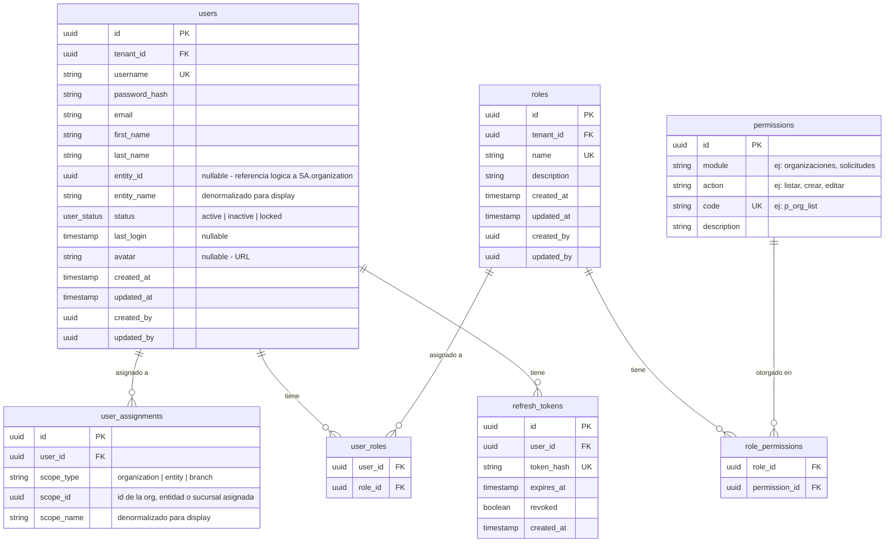
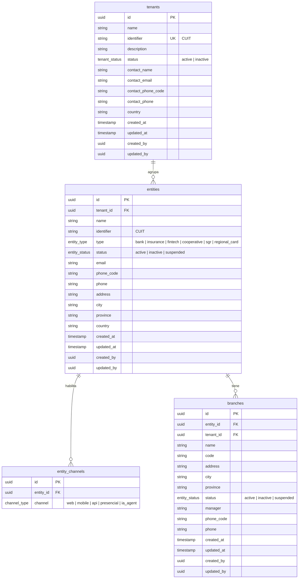
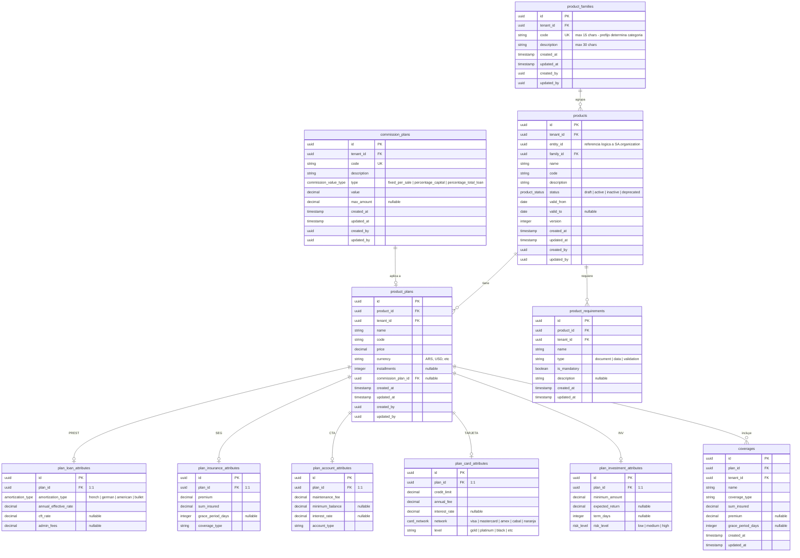
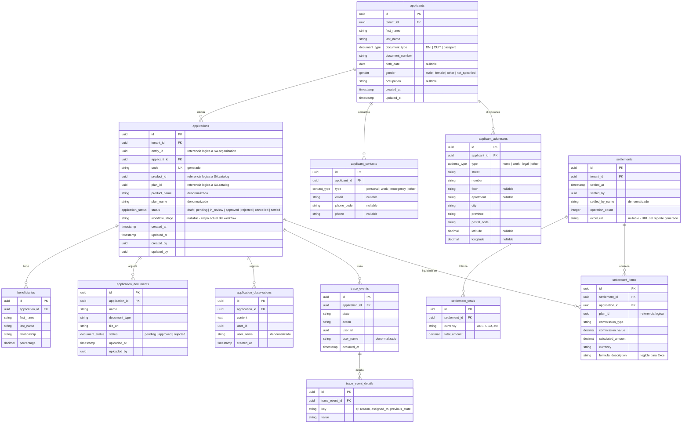
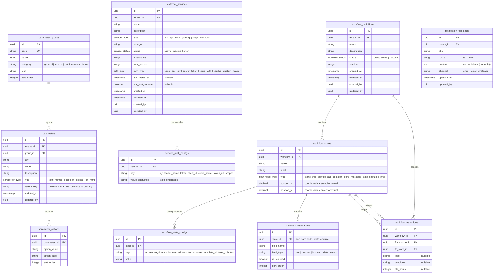
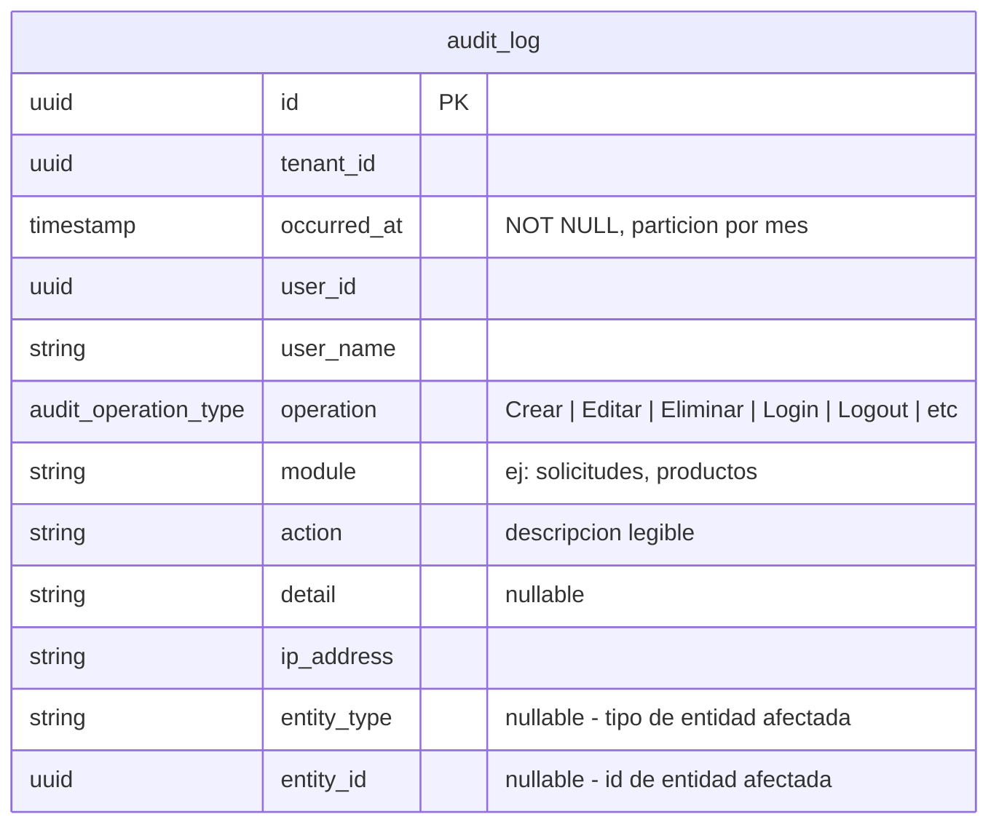
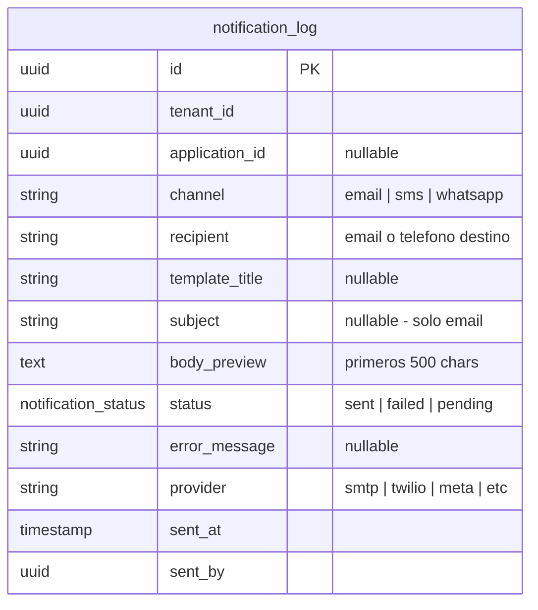

# 05 — Modelo de Datos

> **Proyecto:** Unazul Backoffice
> **Version:** 1.0.0
> **Fecha:** 2026-03-15
> **Prerequisitos:** `01_alcance_funcional.md`, `02_arquitectura.md`

---

## Principios

1. **Database-per-service:** cada microservicio tiene su propia base de datos PostgreSQL. No se comparten esquemas ni conexiones entre servicios.
2. **RLS obligatorio:** toda tabla con datos multi-tenant incluye columna `tenant_id` y una policy RLS `USING (tenant_id = current_setting('app.current_tenant')::uuid)`. El middleware setea `SET app.current_tenant` por request.
3. **Columnas de auditoria:** todas las tablas incluyen `created_at`, `updated_at`, `created_by`, `updated_by`.
4. **PKs:** `uuid` generado por la aplicacion (UUIDv7 recomendado para orden temporal).
5. **Soft delete:** no se usa. Las eliminaciones son fisicas con evento de auditoria via RabbitMQ.
6. **Naming:** snake_case para tablas y columnas. Nombres en ingles.

---

## 1. SA.identity (Identity Service)

Responsabilidad: autenticacion, usuarios, roles, permisos.



**RLS:** aplica a `users`, `user_assignments`, `roles`, `user_roles`, `role_permissions`, `refresh_tokens`.
**Nota:** `permissions` es tabla de referencia global, sin `tenant_id`.

**Indices clave:**
- `users(tenant_id, username)` UNIQUE
- `users(tenant_id, email)` UNIQUE
- `users(tenant_id, entity_id)`
- `users(tenant_id, status)`
- `user_assignments(user_id, scope_type, scope_id)` UNIQUE
- `refresh_tokens(token_hash)` UNIQUE

---

## 2. SA.organization (Organization Service)

Responsabilidad: tenants (organizaciones), entidades, sucursales.



**RLS:** aplica a `entities`, `entity_channels`, `branches`. `tenants` no lleva RLS (el tenant_id ES el id de la fila; el acceso se controla por claim).

**Indices clave:**
- `tenants(identifier)` UNIQUE
- `entities(tenant_id, identifier)` UNIQUE
- `entities(tenant_id, status)`
- `entity_channels(entity_id, channel)` UNIQUE
- `branches(entity_id)`
- `branches(tenant_id, code)` UNIQUE

---

## 3. SA.catalog (Catalog Service)

Responsabilidad: familias, productos, sub-productos (planes), coberturas, requisitos, comisiones.



**Atributos por categoria (tabla 1:1 segun prefijo de familia):**

| Prefijo familia | Tabla de atributos | Relacion |
|---|---|---|
| `PREST` | `plan_loan_attributes` | 1:1 con `product_plans` |
| `SEG` | `plan_insurance_attributes` | 1:1 con `product_plans` |
| `CTA` | `plan_account_attributes` | 1:1 con `product_plans` |
| `TARJETA` | `plan_card_attributes` | 1:1 con `product_plans` |
| `INV` | `plan_investment_attributes` | 1:1 con `product_plans` |

Cada plan tiene exactamente una tabla de atributos segun la categoria de su familia. La aplicacion determina cual tabla usar a partir del prefijo del codigo de familia.

**RLS:** aplica a todas las tablas.

**Indices clave:**
- `product_families(tenant_id, code)` UNIQUE
- `products(tenant_id, entity_id, status)`
- `products(tenant_id, family_id)`
- `product_plans(product_id)`
- `plan_loan_attributes(plan_id)` UNIQUE
- `plan_insurance_attributes(plan_id)` UNIQUE
- `plan_account_attributes(plan_id)` UNIQUE
- `plan_card_attributes(plan_id)` UNIQUE
- `plan_investment_attributes(plan_id)` UNIQUE
- `commission_plans(tenant_id, code)` UNIQUE

---

## 4. SA.operations (Operations Service)

Responsabilidad: solicitudes, liquidaciones, documentos, trazabilidad.



**RLS:** aplica a `applications`, `applicants`, `settlements`, `settlement_items`. Las tablas hijas heredan filtro via JOIN con `applications.tenant_id`.

**Indices clave:**
- `applicants(tenant_id, document_type, document_number)` UNIQUE
- `applicant_contacts(applicant_id)`
- `applications(tenant_id, status)`
- `applications(tenant_id, entity_id)`
- `applications(tenant_id, applicant_id)`
- `applications(code)` UNIQUE
- `trace_events(application_id, occurred_at)`
- `trace_event_details(trace_event_id)`
- `settlements(tenant_id, settled_at DESC)`
- `settlement_totals(settlement_id)`
- `settlement_items(settlement_id)`
- `settlement_items(application_id)`

---

## 5. SA.config (Config Service)

Responsabilidad: parametros, servicios externos, workflows, plantillas.



**RLS:** aplica a `parameters`, `parameter_options`, `external_services`, `service_auth_configs`, `workflow_definitions`, `workflow_states`, `workflow_state_configs`, `workflow_state_fields`, `workflow_transitions`, `notification_templates`. `parameter_groups` es tabla de referencia global.

**Indices clave:**
- `parameters(tenant_id, group_id, key)` UNIQUE
- `parameters(tenant_id, parent_key)` para filtro jerarquico
- `parameter_options(parameter_id, sort_order)`
- `external_services(tenant_id, name)` UNIQUE
- `service_auth_configs(service_id, key)` UNIQUE
- `workflow_definitions(tenant_id, status)`
- `workflow_states(workflow_id)`
- `workflow_state_configs(state_id, key)` UNIQUE
- `workflow_state_fields(state_id, sort_order)`
- `workflow_transitions(workflow_id)`
- `notification_templates(tenant_id, channel)`

---

## 6. SA.audit (Audit Service)

Responsabilidad: log inmutable de acciones del sistema. Solo INSERT, nunca UPDATE ni DELETE.



**Particionamiento:** tabla particionada por rango en `occurred_at` (mensual). Las particiones antiguas se archivan.

**Sin RLS:** el filtro por `tenant_id` se aplica en la query de la API, no por RLS, porque el Audit Service es consumidor async y no recibe contexto de request HTTP.

**Dual write:** cada entrada se persiste en PostgreSQL (fuente de verdad) Y se indexa en Elasticsearch (`audit-{yyyy.MM.dd}`) para busqueda full-text.

**Indices clave:**
- `audit_log(tenant_id, occurred_at DESC)` — consulta principal
- `audit_log(tenant_id, module, occurred_at DESC)`
- `audit_log(tenant_id, user_id, occurred_at DESC)`
- `audit_log(entity_type, entity_id)` — buscar historial de una entidad

---

## 7. SA.notification (Notification Service)

Responsabilidad: registro de notificaciones enviadas. Solo INSERT.



**Sin RLS:** mismo caso que Audit — servicio async sin contexto HTTP.

**Indices clave:**
- `notification_log(tenant_id, sent_at DESC)`
- `notification_log(application_id)`

---

## 8. Tipos enumerados (compartidos)

Cada servicio define sus propios enums en su esquema. Los valores se sincronizan por convencion, no por tabla compartida.

| Enum | Valores | Usado en |
|---|---|---|
| `tenant_status` | active, inactive | SA.organization |
| `entity_status` | active, inactive, suspended | SA.organization |
| `entity_type` | bank, insurance, fintech, cooperative, sgr, regional_card | SA.organization |
| `user_status` | active, inactive, locked | SA.identity |
| `product_status` | draft, active, inactive, deprecated | SA.catalog |
| `application_status` | draft, pending, in_review, approved, rejected, cancelled, settled | SA.operations |
| `workflow_status` | draft, active, inactive | SA.config |
| `contact_type` | personal, work, emergency, other | SA.operations |
| `address_type` | home, work, legal, other | SA.operations |
| `document_type` | DNI, CUIT, passport | SA.operations |
| `gender` | male, female, other, not_specified | SA.operations |
| `document_status` | pending, approved, rejected | SA.operations |
| `commission_value_type` | fixed_per_sale, percentage_capital, percentage_total_loan | SA.catalog |
| `service_type` | rest_api, mcp, graphql, soap, webhook | SA.config |
| `auth_type` | none, api_key, bearer_token, basic_auth, oauth2, custom_header | SA.config |
| `service_status` | active, inactive, error | SA.config |
| `channel_type` | web, mobile, api, presencial, ia_agent | SA.organization |
| `amortization_type` | french, german, american, bullet | SA.catalog |
| `card_network` | visa, mastercard, amex, cabal, naranja | SA.catalog |
| `risk_level` | low, medium, high | SA.catalog |
| `flow_node_type` | start, end, service_call, decision, send_message, data_capture, timer | SA.config |
| `parameter_type` | text, number, boolean, select, list, html | SA.config |
| `audit_operation_type` | Crear, Editar, Eliminar, Login, Logout, Cambiar Contrasena, Cambiar Estado, Liquidar, Exportar, Consultar, Otro | SA.audit |
| `notification_status` | sent, failed, pending | SA.notification |

---

## 9. Referencias cruzadas entre servicios

Los microservicios no hacen JOINs entre bases de datos. Las referencias se manejan asi:

| Servicio origen | Campo | Referencia logica a | Estrategia |
|---|---|---|---|
| SA.identity | `users.entity_id` | SA.organization `entities.id` | UUID almacenado + `entity_name` denormalizado |
| SA.catalog | `products.entity_id` | SA.organization `entities.id` | UUID almacenado; validacion sync via HTTP al crear |
| SA.operations | `applications.product_id`, `plan_id` | SA.catalog | UUID almacenado + `product_name`, `plan_name` denormalizados |
| SA.operations | `applications.entity_id` | SA.organization `entities.id` | UUID almacenado |
| SA.operations | `trace_events.user_id` | SA.identity `users.id` | UUID almacenado + `user_name` denormalizado |
| SA.audit | `audit_log.user_id` | SA.identity `users.id` | UUID + `user_name` denormalizado (viene en el evento) |

**Regla:** cuando se necesita mostrar un nombre de otra base de datos, se denormaliza al momento de escribir. No se hacen lookups sync para lectura.

---

## 10. Politica RLS — Template

Cada tabla multi-tenant aplica esta policy generada por migracion EF Core:

```sql
-- Habilitar RLS
ALTER TABLE {table_name} ENABLE ROW LEVEL SECURITY;
ALTER TABLE {table_name} FORCE ROW LEVEL SECURITY;

-- Policy de tenant
CREATE POLICY tenant_isolation ON {table_name}
    USING (tenant_id = current_setting('app.current_tenant')::uuid);

-- El middleware .NET ejecuta antes de cada query:
-- SET LOCAL app.current_tenant = '{tenant_id_from_jwt}';
```

**Excepciones (sin RLS):**
- `permissions` (SA.identity) — catalogo global
- `parameter_groups` (SA.config) — catalogo global
- `audit_log` (SA.audit) — consumidor async, filtro en query
- `notification_log` (SA.notification) — consumidor async, filtro en query

---

## 11. Almacenamiento de archivos (File Storage)

Los archivos generados y subidos por el sistema se almacenan en el file system, nunca en la base de datos. Las tablas solo guardan la ruta relativa al archivo.

### Ruta base

```
{STORAGE_ROOT}/
```

`STORAGE_ROOT` se configura por variable de entorno (ej: `/data/unazul` en Linux, `D:\unazul-storage` en Windows). En desarrollo se usa una carpeta local; en produccion puede montarse como volumen de red o storage compartido.

### Estructura de carpetas

```
{STORAGE_ROOT}/
├── {tenant_id}/
│   ├── settlements/
│   │   └── {yyyy}/{MM}/
│   │       └── {settlement_id}.xlsx
│   ├── documents/
│   │   └── {application_id}/
│   │       └── {document_id}_{original_filename}
│   └── exports/
│       └── {yyyy}/{MM}/
│           └── {export_type}_{timestamp}.xlsx
```

### Convencion de nombres

| Tipo de archivo | Patron de nombre | Ejemplo |
|---|---|---|
| Reporte de liquidacion | `{settlement_id}.xlsx` | `a1b2c3d4-...-e5f6.xlsx` |
| Documento de solicitud | `{document_id}_{original_filename}` | `d7e8f9a0-...-b1c2_dni_frente.pdf` |
| Exportacion auditoria | `audit_{timestamp}.xlsx` | `audit_20260315_143022.xlsx` |
| Exportacion solicitudes | `applications_{timestamp}.xlsx` | `applications_20260315_150000.xlsx` |

### Reglas

1. **Aislamiento por tenant:** todo archivo se guarda bajo `{STORAGE_ROOT}/{tenant_id}/`. Ningun servicio accede a carpetas de otro tenant.
2. **Solo la ruta relativa en DB:** las columnas `file_url` y `excel_url` almacenan la ruta relativa desde `STORAGE_ROOT` (ej: `{tenant_id}/settlements/2026/03/{id}.xlsx`). La ruta absoluta se resuelve en runtime.
3. **Inmutabilidad de liquidaciones:** los archivos Excel de liquidacion no se sobreescriben ni eliminan. Son registros historicos.
4. **Limpieza de documentos:** cuando se elimina una solicitud, sus archivos en `documents/{application_id}/` se eliminan fisicamente junto con los registros en DB.
5. **Permisos del file system:** el proceso del Operations Service debe tener permisos de lectura/escritura en `{STORAGE_ROOT}`. Ningun otro servicio escribe archivos (Audit exporta via Operations).
