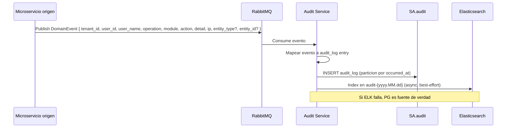
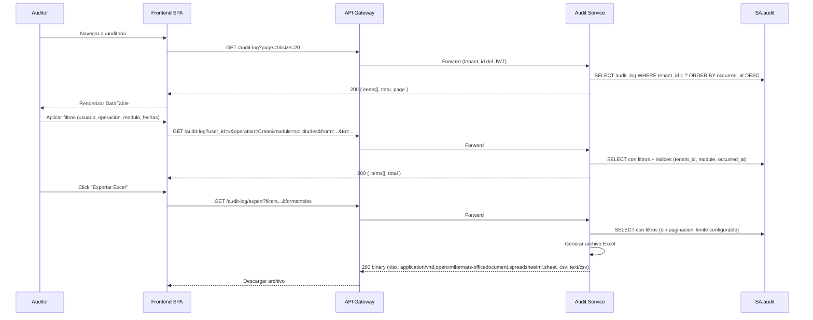

# FL-AUD-01 — Consultar Log de Auditoria

> **Dominio:** Audit
> **Version:** 1.2.0
> **HUs:** HU027

---

## 1. Objetivo

Permitir a auditores y super admins consultar el registro inmutable de todas las acciones del sistema, con filtros por usuario, operacion, modulo y rango de fechas, y exportar los resultados.

## 2. Alcance

**Dentro:**
- Consulta paginada del log de auditoria.
- Filtros: usuario, tipo de operacion, modulo, rango de fechas.
- Exportacion Excel/CSV.
- Registro inmutable: INSERT-only, sin UPDATE ni DELETE desde la API ni desde la base de datos (protegido por falta de grants — RN-AUD-01).
- Ingesta asincrona de eventos desde todos los microservicios via RabbitMQ.

**Fuera:**
- Busqueda full-text via Elasticsearch (evolucion futura; ES se usa actualmente solo para indexacion best-effort, no para consultas API).
- Alertas automaticas sobre patrones anomalos.
- Dashboards de auditoria en tiempo real.
- Retencion automatica / purge de registros antiguos (manual por DBA).

## 3. Actores y Ownership

| Actor | Rol en el flujo |
|-------|----------------|
| Auditor | Consulta y exporta log de auditoria (solo lectura) |
| Super Admin | Mismo acceso que Auditor |
| Audit Service | Consume eventos, persiste en SA.audit, responde consultas |
| Microservicios origen (publisher) | Publican DomainEvent al bus de mensajes (Identity, Organization, Catalog, Config, Operations) |
| RabbitMQ (transport) | Bus de mensajes para eventos async |

## 4. Precondiciones

- Audit Service y SA.audit operativos.
- Usuario autenticado con JWT valido (claims: tenant_id, sub, permissions).
- Usuario con rol **Auditor** o **Super Admin**, y permiso `audit:read` (consulta) o `audit:export` (exportacion).
- Tabla `audit_log` particionada por mes, con particion del mes actual activa (usar pg_partman o job preventivo para creacion automatica de particion N+1).
- Microservicios publicando eventos de dominio (UserCreatedEvent, ProductUpdatedEvent, etc.).
- MassTransit consumers configurados en Audit Service.

## 5. Postcondiciones

- Consulta: resultados paginados filtrados por tenant.
- Exportacion: archivo Excel/CSV generado y descargado.
- Ingesta: cada evento de dominio genera exactamente un registro en `audit_log`.

## 6. Secuencia Principal — Ingesta de Eventos

> **Denormalizacion:** `user_name` se denormaliza al momento de escribir — viene en el evento DomainEvent. No se hace lookup sync a SA.identity durante la ingesta. Decision: RN-AUD-09.

> **Enum operation:** Los valores validos de `operation` son: Crear, Editar, Eliminar, Login, Logout, Cambiar Contrasena, Cambiar Estado, Liquidar, Exportar, Consultar, Otro. Definido en RN-AUD-10.

## 7. Secuencia Principal — Consulta

> **Parametros adicionales:** Ademas de los filtros mostrados, la API acepta `sort` (campo de ordenamiento, default: occurred_at) y `order` (asc/desc, default: desc). Ver RF-AUD-01.

> **Export MIME types:** xlsx → `application/vnd.openxmlformats-officedocument.spreadsheetml.sheet`, csv → `text/csv`. Ambos formatos soportados via parametro `format`.

## 8. Secuencias Alternativas

### 8a. Reintento de Ingesta (MassTransit)

| Paso | Accion |
|------|--------|
| 1 | Consumer falla al insertar en DB |
| 2 | MassTransit retry: 3 intentos con backoff exponencial (5s/15s/45s) |
| 3 | Si agota reintentos: mensaje va a Dead Letter Queue (DLQ) |
| 4 | Alerta operativa sobre DLQ depth |
| 5 | Reproceso manual desde DLQ |

> **Clasificacion de errores:**
> - **No retriable (→ DLQ directo, sin consumir reintentos):** tenant_id nulo o invalido, campos requeridos ausentes, operation value invalido. Reintentar no resolvera errores de validacion.
> - **Retriable (→ retry con backoff exponencial, max 3):** DB no disponible, timeout de conexion, error de particion. Son errores de infraestructura transitorios.

> **DLQ operativo:** La alerta operativa sobre profundidad de DLQ y el reproceso manual son procesos operativos fuera del alcance de RF en esta version. Se gestionan via herramientas de monitoreo (RabbitMQ Management UI).

### 8b. Fallo de Elasticsearch en Ingesta

| Condicion | Resultado |
|-----------|-----------|
| ES no disponible al indexar evento | INSERT en PG procede OK (fuente de verdad). Log warning sobre fallo ES. No se envia a DLQ ni retry por fallo ES (AUD-03-E06) |
| ES disponible | Indexacion async best-effort en `audit-{yyyy.MM.dd}` |

### 8c. Exportacion con Volumen Alto

| Condicion | Resultado |
|-----------|-----------|
| < 10,000 registros | Exportacion sincrona, descarga inmediata |
| > 10,000 registros | **Rechazar con 422** (AUD-02-E05) — mensaje "Result exceeds 10000 records. Narrow date range." |

### 8d. Validacion de Formato de Exportacion

| Condicion | Resultado |
|-----------|-----------|
| `format` = `xlsx` o `csv` | Procede con exportacion |
| `format` con valor distinto (e.g. `pdf`) | **422 Unprocessable Entity** (AUD-02-E03) — "format must be xlsx or csv" |

### 8e. Fallo de Base de Datos en Consulta y Exportacion

| Condicion | Resultado |
|-----------|-----------|
| SA.audit no disponible durante consulta paginada | 500 Internal Server Error (AUD-01-E06) + log estructurado |
| SA.audit no disponible durante exportacion | 500 Internal Server Error (AUD-02-E06) + log estructurado |
| Timeout en COUNT query de consulta (> 3s) | 504 Gateway Timeout (AUD-01-E07, configurable) |
| Timeout en COUNT query de exportacion (> 5s) | 504 Gateway Timeout (AUD-02-E07, configurable) |

## 9. Slice de Arquitectura

- **Servicio owner:** Audit Service (.NET 10, SA.audit)
- **Comunicacion sync:** SPA → API Gateway → Audit Service (solo consultas GET)
- **Comunicacion async:** Todos los microservicios → RabbitMQ → Audit Service (ingesta)
- **Sin RLS:** consultas GET obtienen `tenant_id` del JWT (hay contexto HTTP). Ingesta async obtiene `tenant_id` del payload del evento (sin contexto HTTP). En ambos casos el filtro es en la query, no por RLS.
- **Particionamiento:** tabla `audit_log` particionada por mes en `occurred_at`
- **Dual write:** PG (fuente de verdad) + ES (logs operativos, best-effort)

## 10. Data Touchpoints

| Entidad | Operacion | Evento |
|---------|-----------|--------|
| `audit_log` (PG) | INSERT (ingesta async), SELECT (consulta y exportacion) | Consume: todos los DomainEvents del sistema |
| `audit_log` (PG) | INSERT (indirecto via evento) | La accion de exportar genera DomainEvent con operation=Exportar, que se ingesta via RF-AUD-03 (feedback loop de auto-auditoria) |
| `audit-{yyyy.MM.dd}` (ES) | INDEX (async, best-effort) | Cada evento ingestado se indexa en ES; si ES falla, PG es fuente de verdad (AUD-03-E06) |

**Indices utilizados en consulta:**
- `audit_log(tenant_id, occurred_at DESC)` — consulta principal
- `audit_log(tenant_id, module, occurred_at DESC)` — filtro por modulo
- `audit_log(tenant_id, user_id, occurred_at DESC)` — filtro por usuario
- `audit_log(entity_type, entity_id)` — buscar historial de una entidad

> **Indice `(entity_type, entity_id)`:** Reservado para consultas directas a BD y futuro endpoint de historial de entidad. No expuesto via API REST en esta version.

> **Elasticsearch:** Schema del documento ES = mismos campos que audit_log. Definicion de mapping diferida a RF de busqueda full-text (futuro). Riesgo: schema drift entre PG y ES si no se centraliza el contrato.

> **Performance nota:** Las consultas paginadas y de exportacion ejecutan dos queries: COUNT (total) + SELECT (datos). Se recomienda timeout de 3-5s para COUNT. Para tenants con >1M registros sin filtro de fecha, considerar count estimado (`reltuples`). Evaluar indice covering `(tenant_id, operation, occurred_at DESC)` para combinaciones frecuentes de filtros.

## 11. RF Candidatos para `04_RF.md`

| RF candidato | Descripcion | Origen FL |
|-------------|-------------|-----------|
| RF-AUD-01 | Consultar log de auditoria con filtros y paginacion | Seccion 7 |
| RF-AUD-02 | Exportar log de auditoria a Excel/CSV | Seccion 7 |
| RF-AUD-03 | Ingesta asincrona de eventos de dominio | Seccion 6 |

## 12. Riesgos y Mitigaciones

| Riesgo | Impacto | Mitigacion |
|--------|---------|------------|
| Evento perdido entre microservicio y Audit | Alto | MassTransit retry + DLQ + alerta; PG es fuente de verdad |
| Consulta lenta en tablas grandes | Medio | Particionamiento mensual + indices compuestos; limite de rango en exportacion |
| Elasticsearch desincronizado con PG | Bajo | ES es best-effort para logs; consulta API usa PG; evolucion futura a C |
| Particiones antiguas sin archivar | Bajo | Politica de retencion documentada; archivado manual por DBA en MVP |
| Particion mensual inexistente al inicio de mes | Medio | Usar pg_partman para creacion automatica, o job preventivo que crea particion N+1 |
| COUNT lento en tenants con alto volumen (>1M) | Medio | Timeout configurable (3-5s); fallback a count estimado con flag `exact: false` |
| Export sincrono lento con 10,000 filas | Medio | SLA sugerido: max 10 segundos. Exportacion asincrona para volumenes mayores en version futura |
| Schema drift PG vs ES | Bajo | Centralizar contrato de campos; mapping ES diferido a fase full-text search |

## 13. RF Handoff Checklist

- [x] Actor ownership explicito en cada paso.
- [x] Diagramas explican el flujo sin prosa larga.
- [x] Riesgos y mitigaciones documentados.
- [x] Traducible a RF atomicos y testeables.
- [x] Dentro del limite de 1 pagina.
- [x] Sin dependencias criticas desconocidas.

---

## Changelog

### 1.2.0
- Cross-reference con RF-AUD.md v1.1.0 — alineacion de inmutabilidad, actores, errores tipados, timeouts y ES best-effort en secciones 2-10.

### 1.1.0
- Actores, precondiciones, secuencias alternativas y data touchpoints enriquecidos post-RF-AUD.md v1.0.0.

### 1.0.0
- Version inicial.
