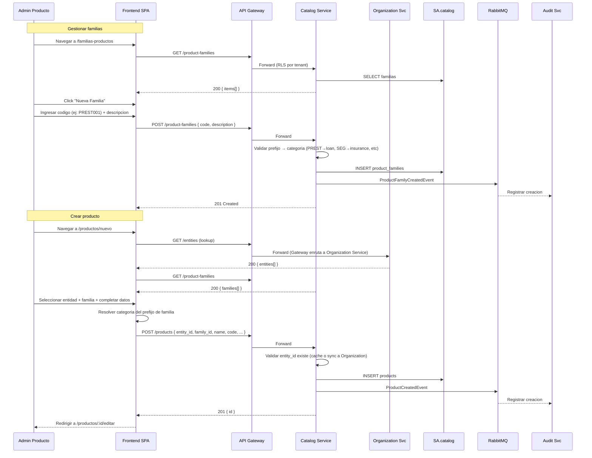
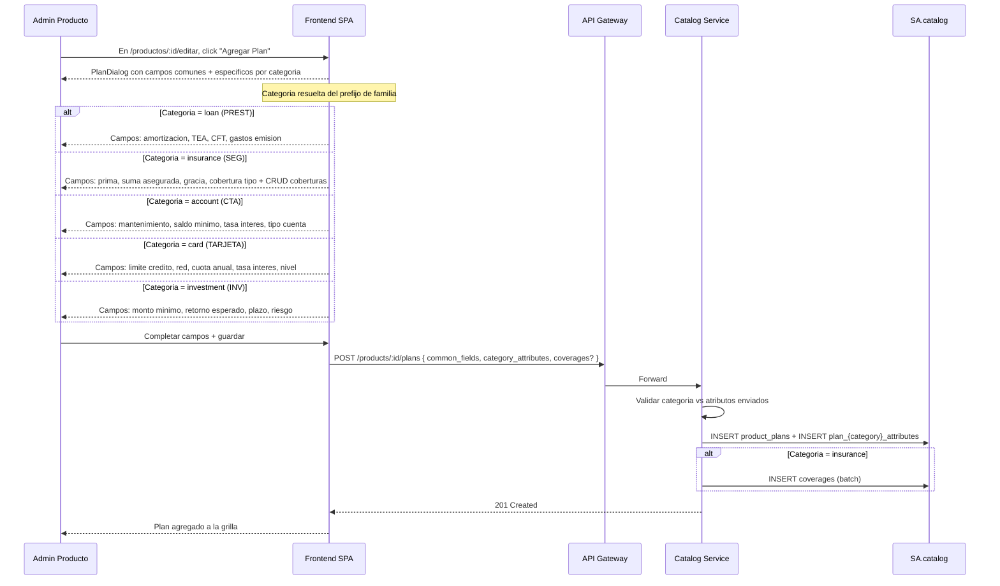

# FL-CAT-01 — Gestionar Catalogo de Productos

> **Dominio:** Catalog
> **Version:** 1.0.0
> **HUs:** HU014, HU015, HU016, HU017, HU018, HU019, HU030, HU031

---

## 1. Objetivo

Permitir la gestion completa del catalogo financiero: familias de productos, productos con planes/sub-productos diferenciados por categoria (prestamos, seguros, cuentas, tarjetas, inversiones), coberturas, requisitos y planes de comisiones.

## 2. Alcance

**Dentro:**
- CRUD de familias de productos (prefijo determina categoria).
- CRUD de productos vinculados a entidad y familia.
- CRUD de planes/sub-productos con atributos especificos por categoria (5 tablas 1:1).
- CRUD de coberturas dentro de planes de seguros.
- CRUD de requisitos documentales por producto.
- CRUD de planes de comisiones (1:N con planes de producto).
- Listado con filtros, busqueda y exportacion Excel/CSV (exportacion aplica al listado de productos).
- Vista detalle de producto con planes, requisitos y atributos.

**Fuera:**
- Comparacion entre productos o versiones.
- Aprobacion/workflow para publicar productos.
- Clonado de productos entre entidades.
- Catalogo publico (API abierta).

## 3. Actores y Ownership

| Actor | Rol en el flujo |
|-------|----------------|
| Admin Producto | CRUD completo de familias, productos, planes, coberturas, requisitos, comisiones |
| Super Admin | Mismo acceso que Admin Producto |
| Admin Entidad | CRUD de productos de su entidad |
| Consulta / Auditor / Operador | Solo lectura: listar familias, listar productos, ver detalle de producto y planes |
| Catalog Service | Persiste catalogo, valida consistencia familia-categoria-atributos |
| Organization Service | Provee listado de entidades (lookup sync al crear producto) |
| Audit Service | Registra cambios de catalogo |

## 4. Precondiciones

- Catalog Service y SA.catalog operativos.
- Al menos una entidad activa en Organization Service (para asociar productos).
- Parametros de datos maestros cargados: `card_networks`, `card_levels`, `insurance_coverages` (para selects en planes).
- Familias existentes antes de crear productos.

## 5. Postcondiciones

- Familia creada: registro en `product_families`, evento ProductFamilyCreatedEvent.
- Producto creado/editado: registro en `products` con planes, atributos, requisitos, evento ProductCreatedEvent/ProductUpdatedEvent.
- Producto con planes: solo puede cambiar a estado `deprecated` (no se elimina fisicamente).
- Plan de comision creado: registro en `commission_plans`, asignable a multiples planes.

## 6. Secuencia Principal — Familias y Productos

## 7. Secuencia — Planes con Atributos por Categoria

## 8. Secuencias Alternativas

### 8a. Eliminar Familia

| Condicion | Resultado |
|-----------|-----------|
| Familia sin productos | Eliminacion fisica + ProductFamilyDeletedEvent |
| Familia con productos | 409 "Familia con N productos asociados, no se puede eliminar" |

### 8b. Eliminar / Deprecar Producto

| Condicion | Resultado |
|-----------|-----------|
| Producto sin planes | Eliminacion fisica + ProductDeletedEvent |
| Producto con planes | Solo puede cambiar a status = `deprecated` (PUT /products/:id { status: deprecated }) |

### 8c. Planes de Comisiones (CRUD)

| Paso | Accion | Detalle |
|------|--------|---------|
| 1 | Listar | GET /commission-plans → grilla con codigo, descripcion, tipo, valor, max, count de planes asignados |
| 2 | Crear | POST /commission-plans { code, description, type, value, max_amount? } |
| 3 | Editar | PUT /commission-plans/:id { ... } |
| 4 | Eliminar | DELETE /commission-plans/:id — solo si no asignado a ningun plan (409 si en uso) |
| 5 | Asignar | Desde PlanDialog: select de commission_plan_id (1:N, un plan de comision puede estar en multiples planes) |

### 8d. Requisitos Documentales (CRUD inline)

| Paso | Accion | Detalle |
|------|--------|---------|
| 1 | Listar | Grilla en formulario de producto con nombre, tipo, obligatorio, descripcion |
| 2 | Agregar | POST /products/:id/requirements { name, type, is_mandatory, description? } |
| 3 | Editar | PUT /products/:id/requirements/:req_id { ... } |
| 4 | Eliminar | DELETE /products/:id/requirements/:req_id |

### 8e. Coberturas de Seguros (CRUD inline en PlanDialog)

| Paso | Accion | Detalle |
|------|--------|---------|
| 1 | Agregar | Select de coberturas parametrizadas (filtrado: ya agregadas no aparecen) |
| 2 | Configurar | Suma asegurada ($) + Prima ($) por cobertura |
| 3 | Eliminar | Click X → cobertura vuelve al select |
| 4 | Persistencia | Se guarda batch al guardar el plan (tabla `coverages`) |

## 9. Slice de Arquitectura

- **Servicio owner:** Catalog Service (.NET 10, SA.catalog)
- **Comunicacion sync:** SPA → API Gateway → Catalog Service
- **Lookup sync:** Catalog → Organization Service (validar entity_id al crear producto, cacheable)
- **Comunicacion async:** Catalog → RabbitMQ → Audit Service
- **RLS:** aplica a todas las tablas de SA.catalog
- **Parametros (Config Service):** `card_networks`, `card_levels`, `insurance_coverages` consumidos via cache/API

## 10. Data Touchpoints

| Entidad | Operacion | Evento |
|---------|-----------|--------|
| `product_families` | INSERT, UPDATE, DELETE | ProductFamilyCreatedEvent, ProductFamilyUpdatedEvent, ProductFamilyDeletedEvent |
| `products` | INSERT, UPDATE | ProductCreatedEvent, ProductUpdatedEvent |
| `product_plans` | INSERT, UPDATE, DELETE | — (incluido en Product events) |
| `plan_loan_attributes` | INSERT, UPDATE, DELETE (1:1) | — |
| `plan_insurance_attributes` | INSERT, UPDATE, DELETE (1:1) | — |
| `plan_account_attributes` | INSERT, UPDATE, DELETE (1:1) | — |
| `plan_card_attributes` | INSERT, UPDATE, DELETE (1:1) | — |
| `plan_investment_attributes` | INSERT, UPDATE, DELETE (1:1) | — |
| `coverages` | INSERT, UPDATE, DELETE (batch) | — |
| `product_requirements` | INSERT, UPDATE, DELETE | — (incluido en Product events) |
| `commission_plans` | INSERT, UPDATE, DELETE | CommissionPlanCreatedEvent, CommissionPlanUpdatedEvent, CommissionPlanDeletedEvent |

**Estados relevantes:**
- `product_status` — maquina de estados:
  - `draft` → `active` (activacion manual)
  - `active` → `inactive` (desactivacion manual)
  - `active` → `deprecated` (solo manual, requiere que el producto tenga planes; estado terminal)
  - `inactive` → `active` (reactivacion manual)
- Familias y comisiones no tienen ciclo de estado (existen o no existen).

## 11. RF Candidatos para `04_RF.md`

| RF candidato | Descripcion | Origen FL |
|-------------|-------------|-----------|
| RF-CAT-01 | CRUD de familias de productos con validacion de prefijo | Seccion 6, 8a |
| RF-CAT-02 | Listar productos con filtros, busqueda y exportacion | Seccion 6 |
| RF-CAT-03 | Crear/editar producto con entidad y familia | Seccion 6 |
| RF-CAT-04 | Ver detalle de producto con planes y requisitos | Seccion 6 |
| RF-CAT-05 | CRUD de planes con atributos especificos por categoria | Seccion 7 |
| RF-CAT-06 | CRUD de coberturas de seguros inline | Seccion 8e |
| RF-CAT-07 | CRUD de requisitos documentales inline | Seccion 8d |
| RF-CAT-08 | CRUD de planes de comisiones con validacion de uso | Seccion 8c |
| RF-CAT-09 | Deprecar producto (no eliminar si tiene planes) | Seccion 8b |

## 12. Riesgos y Mitigaciones

| Riesgo | Impacto | Mitigacion |
|--------|---------|------------|
| Inconsistencia prefijo-categoria-atributos | Alto | Doble validacion: frontend resuelve categoria para UX, backend valida al persistir |
| Producto eliminado referenciado en solicitudes (Operations) | Alto | Productos con planes solo se deprecan; datos denormalizados en Operations |
| Parametros de selects no cargados (card_networks, etc) | Medio | Fallback a lista vacia con warning; seed data obligatorio |
| Plan de comision eliminado mientras esta asignado | Medio | Verificacion de uso antes de eliminar (409 si en uso) |
| Proliferacion de productos deprecated | Bajo | Filtro por defecto excluye deprecated en listados |

## 13. RF Handoff Checklist

- [x] Actor ownership explicito en cada paso.
- [x] Diagramas explican el flujo sin prosa larga.
- [x] Riesgos y mitigaciones documentados.
- [x] Traducible a RF atomicos y testeables.
- [x] Dentro del limite de 2 paginas.
- [x] Sin dependencias criticas desconocidas.
