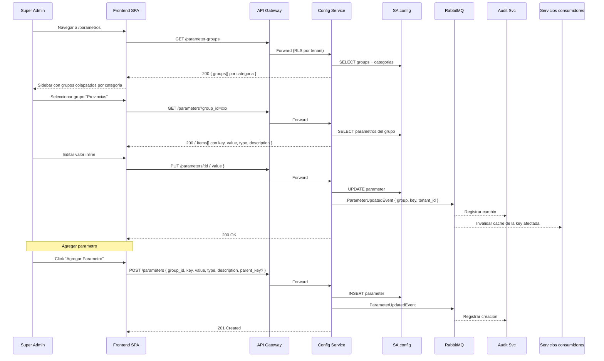

# FL-CFG-01 — Gestionar Parametros y Servicios Externos

> **Dominio:** Config
> **Version:** 1.0.0
> **HUs:** HU020, HU021

---

## 1. Objetivo

Permitir al Super Admin configurar parametros del sistema (datos maestros, mascaras, seguridad) y gestionar conexiones a servicios externos, propagando cambios a todos los microservicios consumidores.

## 2. Alcance

**Dentro:**
- Navegacion por grupos jerarquicos de parametros (4 categorias, 14+ grupos).
- CRUD de parametros con edicion inline y tipos variados (text, number, boolean, select, list, html).
- CRUD de grupos de parametros.
- Relaciones jerarquicas entre parametros (provincia → ciudad).
- CRUD de servicios externos con 5 tipos (REST, MCP, GraphQL, SOAP, Webhook).
- 6 esquemas de autenticacion con credenciales encriptadas.
- Prueba de conexion con registro de resultado.
- Propagacion de cambios via evento async.

**Fuera:**
- Versionado de parametros (no se guarda historial de valores anteriores; auditoria lo cubre).
- Import/export masivo de parametros.
- Monitoreo continuo de servicios externos (health check periodico).
- Eliminacion de servicios externos (se desactivan cambiando status).

## 3. Actores y Ownership

| Actor | Rol en el flujo |
|-------|----------------|
| Super Admin | CRUD de parametros, grupos y servicios externos |
| Config Service | Persiste configuracion, ejecuta pruebas de conexion |
| RabbitMQ | Propaga ParameterUpdatedEvent, ServiceTestedEvent |
| Audit Service | Registra cambios de configuracion |
| Servicios consumidores | Invalidan cache al recibir ParameterUpdatedEvent |

## 4. Precondiciones

- Config Service y SA.config operativos.
- `parameter_groups` inicializado con seed data (14+ grupos en 4 categorias).
- Clave de encriptacion AES-256 disponible como variable de entorno.

## 5. Postcondiciones

- Parametro creado/editado/eliminado: persistido en DB + ParameterUpdatedEvent publicado.
- Servicio externo creado/editado: persistido con credenciales encriptadas.
- Prueba de conexion: `last_tested_at` y `last_test_success` actualizados.

## 6. Secuencia Principal — Parametros



## 7. Secuencia Principal — Servicios Externos

```mermaid
sequenceDiagram
    participant SA as Super Admin
    participant SPA as Frontend SPA
    participant GW as API Gateway
    participant CFG as Config Service
    participant DB as SA.config
    participant EXT as Servicio Externo
    participant RMQ as RabbitMQ
    participant AUD as Audit Svc

    SA->>SPA: Navegar a /servicios
    SPA->>GW: GET /external-services
    GW->>CFG: Forward
    CFG->>DB: SELECT servicios (sin credenciales)
    CFG-->>SPA: 200 { items[] }

    Note over SA,SPA: Crear servicio
    SA->>SPA: Click "Nuevo Servicio"
    SA->>SPA: Completar: nombre, tipo, URL, auth type
    SA->>SPA: Completar credenciales segun auth type
    SPA->>GW: POST /external-services { ..., auth_configs[] }
    GW->>CFG: Forward
    CFG->>CFG: Encriptar credenciales (AES-256)
    CFG->>DB: INSERT external_services + service_auth_configs
    CFG->>RMQ: ServiceCreatedEvent
    RMQ-->>AUD: Registrar creacion
    CFG-->>SPA: 201 Created

    Note over SA,SPA: Editar servicio
    SA->>SPA: Click "Editar" en servicio existente
    SPA->>GW: GET /external-services/:id
    GW->>CFG: Forward
    CFG->>DB: SELECT servicio (credenciales enmascaradas)
    CFG-->>SPA: 200 { name, type, base_url, auth_type, timeout, ... }
    SA->>SPA: Modificar campos (name, base_url, auth_type, timeout)
    SPA->>GW: PUT /external-services/:id { campos modificados }
    GW->>CFG: Forward
    Note over CFG: Si se cambia auth_type, se requieren nuevas credenciales; las anteriores se eliminan.
    CFG->>CFG: Encriptar credenciales si aplica (AES-256)
    CFG->>DB: UPDATE external_services + service_auth_configs
    CFG->>RMQ: ServiceUpdatedEvent
    RMQ-->>AUD: Registrar edicion
    CFG-->>SPA: 200 OK

    Note over SA,SPA: Probar conexion
    SA->>SPA: Click "Probar Conexion"
    SPA->>GW: POST /external-services/:id/test
    GW->>CFG: Forward
    CFG->>DB: Leer configuracion + desencriptar credenciales
    CFG->>EXT: Request de prueba segun tipo
    alt Conexion exitosa
        EXT-->>CFG: 200 OK
        CFG->>DB: UPDATE last_tested_at, last_test_success = true
    else Conexion fallida
        EXT-->>CFG: Error/Timeout
        CFG->>DB: UPDATE last_tested_at, last_test_success = false, status = error
    end
    CFG->>RMQ: ServiceTestedEvent { success }
    RMQ-->>AUD: Registrar resultado
    CFG-->>SPA: 200 { success, response_time_ms, error? }
```

## 8. Secuencias Alternativas

### 8a. Eliminar Parametro

| Paso | Accion | Servicio |
|------|--------|----------|
| 1 | Hover sobre parametro → click eliminar | SPA |
| 2 | Confirmacion: "Este parametro sera eliminado" | SPA |
| 3 | DELETE /parameters/:id | API Gateway → Config |
| 4 | DELETE de DB + ParameterUpdatedEvent | Config |
| 5 | Invalidacion en servicios consumidores | RabbitMQ → Servicios |

### 8b. Eliminar Grupo

| Condicion | Resultado |
|-----------|-----------|
| Grupo sin parametros | Se elimina el grupo |
| Grupo con parametros | 409 "No se puede eliminar un grupo con parametros" |

### 8c. Parametros con Relacion Jerarquica

| Paso | Detalle |
|------|---------|
| Provincia seleccionada en formulario externo | Frontend filtra ciudades por `parent_key = provincia_seleccionada` |
| Config Service responde | GET /parameters?group=ciudades&parent_key=buenos_aires |
| Resultado | Solo ciudades de Buenos Aires |

## 9. Slice de Arquitectura

- **Servicio owner:** Config Service (.NET 10, SA.config)
- **Comunicacion sync:** SPA → API Gateway → Config Service
- **Comunicacion async:** Config → RabbitMQ → Audit, servicios consumidores
- **Encriptacion:** AES-256 para `service_auth_configs.value_encrypted`, key en env var
- **RLS:** aplica a `parameters`, `parameter_options`, `external_services`, `service_auth_configs`
- **Tabla global:** `parameter_groups` (sin tenant_id)

## 10. Data Touchpoints

| Entidad | Operacion | Evento |
|---------|-----------|--------|
| `parameter_groups` | INSERT, DELETE | — (seed + admin) |
| `parameters` | INSERT, UPDATE, DELETE | ParameterUpdatedEvent |
| `parameter_options` | INSERT, UPDATE, DELETE | — (incluido en ParameterUpdated) |
| `external_services` | INSERT, UPDATE | ServiceCreatedEvent, ServiceUpdatedEvent |
| `service_auth_configs` | INSERT, UPDATE, DELETE | — (incluido en Service events) |
| `audit_log` (SA.audit) | INSERT (async) | Consume eventos via RabbitMQ |

## 11. RF Candidatos para `04_RF.md`

| RF candidato | Descripcion | Origen FL |
|-------------|-------------|-----------|
| RF-CFG-01 | Listar grupos de parametros | Seccion 6 |
| RF-CFG-02 | Listar parametros de un grupo | Seccion 6 |
| RF-CFG-03 | Crear parametro | Seccion 6 |
| RF-CFG-04 | Editar valor de parametro | Seccion 6 |
| RF-CFG-05 | Eliminar parametro | Seccion 8a |
| RF-CFG-06 | CRUD de grupos de parametros | Seccion 8b |
| RF-CFG-07 | Filtrar parametros por jerarquia (parent_key) | Seccion 8c |
| RF-CFG-08 | Listar servicios externos | Seccion 7 |
| RF-CFG-09 | Crear servicio externo | Seccion 7 |
| RF-CFG-10 | Editar servicio externo | Seccion 7 |
| RF-CFG-11 | Testear conexion de servicio externo | Seccion 7 |

## 12. Riesgos y Mitigaciones

| Riesgo | Impacto | Mitigacion |
|--------|---------|------------|
| Cache desincronizado tras cambio de parametro | Medio | ParameterUpdatedEvent con consumer por servicio; TTL backup 5min |
| Fuga de credenciales en logs o respuestas API | Alto | Nunca exponer values desencriptados en GET; logging excluye auth configs |
| Parametro critico eliminado accidentalmente | Medio | Confirmacion en UI; evento de auditoria para rollback manual |
| Servicio externo caido bloquea prueba de conexion | Bajo | Timeout configurable; status = error no bloquea otras operaciones |

## 13. RF Handoff Checklist

- [x] Actor ownership explicito en cada paso.
- [x] Diagramas explican el flujo sin prosa larga.
- [x] Riesgos y mitigaciones documentados.
- [x] Traducible a RF atomicos y testeables.
- [x] Dentro del limite de 2 paginas.
- [x] Sin dependencias criticas desconocidas.
