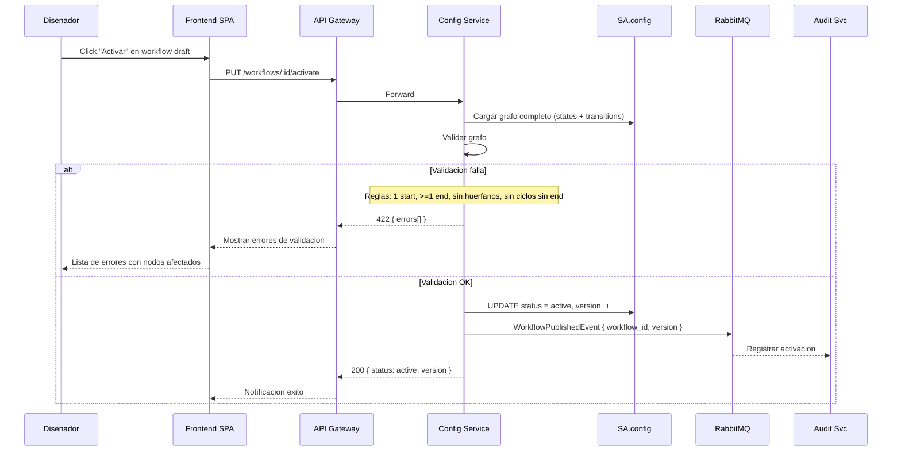

# FL-CFG-02 — Disenar Workflow

> **Dominio:** Config
> **Version:** 1.0.0
> **HUs:** HU022, HU034

---

## 1. Objetivo

Permitir al disenador de procesos crear y editar workflows visuales con 7 tipos de nodo, panel de atributos del dominio y validacion de grafo, para gobernar el ciclo de vida de las solicitudes.

## 2. Alcance

**Dentro:**
- Listar workflows con estado y version.
- Editor visual drag-and-drop (React Flow) con 7 tipos de nodo.
- Configuracion especifica por tipo de nodo (service_call, decision, send_message, data_capture, timer).
- Transiciones con label, condicion y SLA opcionales.
- Panel de atributos del dominio (11 objetos) para arrastrar a condiciones de decision.
- Validacion de grafo al activar (1 start, >=1 end, sin huerfanos, sin ciclos sin end).
- Guardado como draft sin validacion estricta.
- Ciclo de estado: draft → active → inactive.

**Fuera:**
- Ejecucion del workflow en runtime (pertenece a Operations Service).
- Simulacion/testing del workflow.
- Versionado automatico con diff entre versiones.
- Import/export de workflows entre tenants.
- Eliminacion de workflows (solo se desactivan).

## 3. Actores y Ownership

| Actor | Rol en el flujo |
|-------|----------------|
| Disenador de Procesos | Crea, edita, activa/desactiva workflows |
| Super Admin | Mismo acceso que Disenador |
| Config Service | Persiste definicion de workflow, valida grafo |
| Audit Service | Registra creacion, edicion, activacion |

## 4. Precondiciones

- Config Service y SA.config operativos.
- Servicios externos configurados (para nodos `service_call`).
- Plantillas de notificacion configuradas (para nodos `send_message`).
- Catalogo de atributos del dominio definido (11 objetos, ~68 atributos).

## 5. Postcondiciones

- Workflow guardado como draft: definicion persistida (nodos, transiciones, configs) sin validacion.
- Workflow activado: grafo validado, estado = `active`, WorkflowPublishedEvent publicado.
- Workflow desactivado: estado = `inactive`, no se usa para nuevas solicitudes.

## 6. Secuencia Principal — Crear y Editar Workflow

```mermaid
sequenceDiagram
    participant DP as Disenador
    participant SPA as Frontend SPA
    participant GW as API Gateway
    participant CFG as Config Service
    participant DB as SA.config
    participant RMQ as RabbitMQ
    participant AUD as Audit Svc

    Note over DP,SPA: Listar workflows
    DP->>SPA: Navegar a /workflows
    SPA->>GW: GET /workflows
    GW->>CFG: Forward (RLS por tenant)
    CFG->>DB: SELECT workflows con status y version
    CFG-->>SPA: 200 { items[] }

    Note over DP,SPA: Crear workflow
    DP->>SPA: Click "Nuevo workflow"
    SPA-->>DP: Editor visual vacio con canvas React Flow
    SPA->>SPA: Cargar catalogo de atributos (panel derecho)

    DP->>SPA: Completar nombre + descripcion
    DP->>SPA: Agregar nodo start (drag desde paleta)
    DP->>SPA: Agregar nodos del flujo (decision, service_call, etc)
    DP->>SPA: Conectar nodos (drag entre puertos)

    Note over DP,SPA: Configurar nodo
    DP->>SPA: Click en nodo service_call
    SPA-->>DP: NodeConfigDialog con campos especificos
    DP->>SPA: Seleccionar servicio externo + endpoint + metodo
    DP->>SPA: Cerrar dialogo

    Note over DP,SPA: Configurar decision con atributos
    DP->>SPA: Doble click en nodo decision
    SPA-->>DP: Dialogo con campo "Condicion" + panel atributos
    DP->>SPA: Click en atributo "Solicitud.monto"
    SPA->>SPA: Insertar {{Solicitud.monto}} en posicion del cursor
    DP->>SPA: Completar condicion: {{Solicitud.monto}} > 100000
    DP->>SPA: Cerrar dialogo

    Note over DP,SPA: Guardar como draft
    DP->>SPA: Click "Guardar"
    SPA->>GW: POST /workflows { name, description, states[], transitions[] }
    GW->>CFG: Forward
    CFG->>DB: INSERT workflow_definitions + states + configs + fields + transitions
    CFG->>RMQ: WorkflowCreatedEvent
    RMQ-->>AUD: Registrar creacion
    CFG-->>SPA: 201 { id, status: draft, version: 1 }
    Note over CFG: version inicia en 1; solo incrementa al activar, no en cada guardado
```

## 7. Secuencia — Activar Workflow (con validacion)



## 8. Secuencias Alternativas

### 8a. Editar Workflow Existente

| Paso | Accion | Servicio |
|------|--------|----------|
| 1 | Click en workflow de la grilla | SPA |
| 2 | GET /workflows/:id (completo con states, transitions, configs) | Config |
| 3 | Renderizar grafo en canvas React Flow | SPA |
| 4 | Disenador modifica nodos/transiciones | SPA |
| 5 | PUT /workflows/:id { states[], transitions[] } | Config |
| 6 | Si workflow activo: se revierte a draft para edicion | Config |
| 7 | WorkflowUpdatedEvent | Config → RabbitMQ → Audit |

### 8b. Desactivar Workflow

| Paso | Accion | Resultado |
|------|--------|-----------|
| 1 | Click "Desactivar" en workflow activo | SPA |
| 2 | PUT /workflows/:id/deactivate | Config |
| 3 | UPDATE status = inactive | DB |
| 4 | WorkflowDeactivatedEvent | Audit registra |
| 5 | Solicitudes existentes continuan con el workflow vigente | Operations (sin cambio) |

### 8c. Configuracion por Tipo de Nodo

| Tipo de nodo | Campos de configuracion | Persistencia |
|-------------|------------------------|--------------|
| `start` | Nombre | workflow_states |
| `end` | Nombre | workflow_states |
| `service_call` | Servicio externo (select), endpoint, metodo HTTP | workflow_state_configs |
| `decision` | Condicion con atributos del dominio {{Objeto.atributo}} | workflow_state_configs |
| `send_message` | Canal (email/sms/whatsapp), plantilla (select) | workflow_state_configs |
| `data_capture` | Campos dinamicos (nombre, tipo, requerido, orden) | workflow_state_fields |
| `timer` | Minutos de espera | workflow_state_configs |

### 8d. Reglas de Validacion de Grafo

| Regla | Error si no cumple |
|-------|-------------------|
| Exactamente 1 nodo `start` | "Debe haber exactamente un nodo de inicio" |
| Al menos 1 nodo `end` | "Debe haber al menos un nodo de fin" |
| Todos los nodos conectados | "Nodo '{name}' no tiene conexiones" |
| Sin ciclos que no pasen por `end` | "Ciclo detectado entre '{node_a}' y '{node_b}' sin nodo de fin" |
| Todo nodo `service_call` debe referenciar un `external_service_id` existente | "Nodo '{name}' referencia un servicio externo inexistente" |
| Todo nodo `decision` debe tener al menos una condicion | "Nodo '{name}' de tipo decision no tiene condiciones definidas" |
| Todo nodo `send_message` debe referenciar una plantilla de notificacion valida | "Nodo '{name}' referencia una plantilla de notificacion inexistente" |

## 9. Slice de Arquitectura

- **Servicio owner:** Config Service (.NET 10, SA.config)
- **Comunicacion sync:** SPA → API Gateway → Config Service
- **Comunicacion async:** Config → RabbitMQ → Audit Service
- **Frontend:** React Flow (@xyflow/react) para canvas visual
- **RLS:** aplica a `workflow_definitions`, `workflow_states`, `workflow_state_configs`, `workflow_state_fields`, `workflow_transitions`
- **Lookups:** `external_services` (para nodos service_call), `notification_templates` (para nodos send_message)

## 10. Data Touchpoints

| Entidad | Operacion | Evento |
|---------|-----------|--------|
| `workflow_definitions` | INSERT, UPDATE | WorkflowCreatedEvent, WorkflowUpdatedEvent, WorkflowPublishedEvent |
| `workflow_states` | INSERT, UPDATE, DELETE (sync con definicion) | — (incluido en workflow events) |
| `workflow_state_configs` | INSERT, UPDATE, DELETE | — (incluido en workflow events) |
| `workflow_state_fields` | INSERT, UPDATE, DELETE (solo data_capture) | — (incluido en workflow events) |
| `workflow_transitions` | INSERT, UPDATE, DELETE | — (incluido en workflow events) |
| `external_services` | SELECT (lookup para service_call) | — |
| `notification_templates` | SELECT (lookup para send_message) | — |

**Estados relevantes:**
- `workflow_status`: draft → active → inactive
- Edicion de workflow activo: revierte a draft (requiere reactivacion).

## 11. RF Candidatos para `04_RF.md`

| RF candidato | Descripcion | Origen FL |
|-------------|-------------|-----------|
| RF-CFG-12 | Listar workflows con estado y version | Seccion 6 (listar) |
| RF-CFG-13 | Crear/editar workflow en editor visual | Seccion 6 (editor) |
| RF-CFG-14 | Configurar nodo por tipo | Seccion 8c |
| RF-CFG-15 | Panel de atributos con drag & insert en condiciones | Seccion 6 (decision + atributos) |
| RF-CFG-16 | Crear transiciones con label, condicion y SLA | Seccion 6 (conectar) |
| RF-CFG-17 | Validar grafo al activar workflow | Seccion 7 |
| RF-CFG-18 | Desactivar workflow | Seccion 8b |

## 12. Riesgos y Mitigaciones

| Riesgo | Impacto | Mitigacion |
|--------|---------|------------|
| Workflow activado con condiciones de decision incorrectas | Alto | Validacion sintactica de expresiones al activar; testing manual previo |
| Edicion de workflow activo afecta solicitudes en curso | Alto | Solicitudes en curso mantienen version anterior; nueva version solo para nuevas solicitudes |
| Grafo grande degrada performance del editor | Medio | Virtualizacion de React Flow; limite soft de 50 nodos con warning |
| Servicio externo eliminado referenciado por nodo | Medio | Validacion al activar verifica existencia de servicios y plantillas referenciados |

## 13. RF Handoff Checklist

- [x] Actor ownership explicito en cada paso.
- [x] Diagramas explican el flujo sin prosa larga.
- [x] Riesgos y mitigaciones documentados.
- [x] Traducible a RF atomicos y testeables.
- [x] Dentro del limite de 2 paginas.
- [x] Sin dependencias criticas desconocidas.
