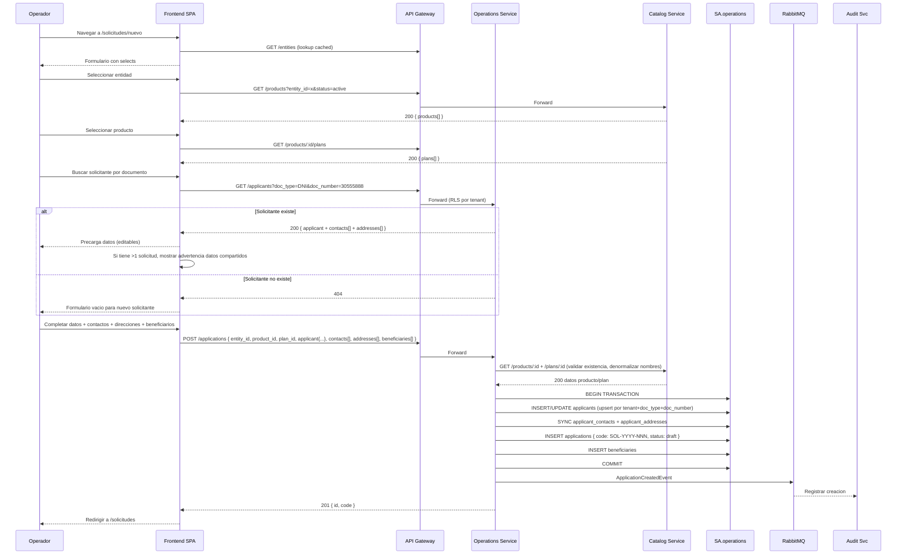
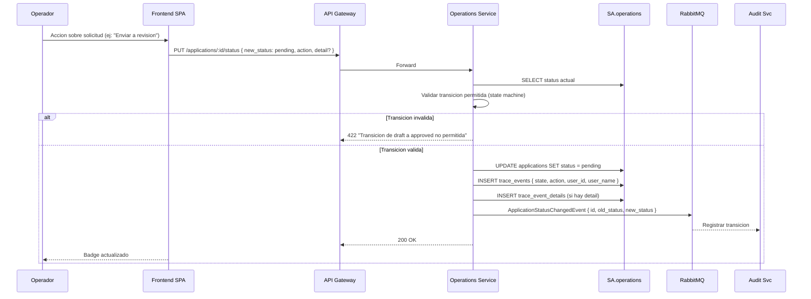

# FL-OPS-01 — Ciclo de Vida de Solicitud

> **Dominio:** Operations
> **Version:** 1.0.0
> **HUs:** HU009, HU010, HU011, HU012, HU013, HU033

---

## 1. Objetivo

Gestionar el ciclo de vida completo de solicitudes de productos financieros: creacion con solicitante reutilizable (1:N), detalle con 8 solapas, transiciones de estado con maquina fija, trazabilidad BPM, y visualizacion de producto asociado.

## 2. Alcance

**Dentro:**
- Listar solicitudes con filtros, busqueda, exportacion.
- Crear/editar solicitud con selects en cascada (entidad→producto→plan).
- Busqueda y reutilizacion de solicitante por documento (1:N con solicitudes).
- CRUD de contactos, direcciones, beneficiarios y documentos del solicitante/solicitud.
- Detalle con 8 solapas (solicitante, producto, contactos, direcciones, beneficiarios, documentos, observaciones, trazabilidad).
- Maquina de estados fija: draft → pending → in_review → approved/rejected → settled/cancelled.
- `workflow_stage` informativo gestionado por workflow.
- Timeline BPM con estados completados, actual y pendientes.
- Solapa producto con atributos especificos por categoria.
- Advertencia de datos compartidos al editar solicitante con multiples solicitudes.

**Fuera:**
- Ejecucion automatica de workflow (motor de ejecucion).
- Asignacion automatica de operadores.
- Notificaciones automaticas por cambio de estado (cubierto en FL-OPS-03).

## 3. Actores y Ownership

| Actor | Rol en el flujo |
|-------|----------------|
| Operador | Crea, edita solicitudes; cambia estados |
| Admin Entidad / Super Admin | Mismo acceso + aprobacion/rechazo |
| Consulta / Auditor | Solo lectura (listar, ver detalle, trazabilidad) |
| Operations Service | Persiste solicitudes, valida transiciones, gestiona solicitantes |
| Catalog Service | Provee datos de producto/plan (lookup sync) |
| Config Service | Provee parametros (provinces, cities) y workflow |
| Audit Service | Registra cambios via eventos async |

## 4. Precondiciones

- Operations Service y SA.operations operativos.
- Al menos una entidad con productos activos en Catalog.
- Parametros provinces/cities cargados en Config.
- Workflow activo asociado (opcional, para trazabilidad BPM).

## 5. Postcondiciones

- Solicitud creada: codigo generado (SOL-YYYY-NNN), status = draft, solicitante creado o reutilizado. `trace_event` creado con `state='draft'` y `action='Solicitud creada'`.
- Transicion de estado: trace_event registrado, ApplicationStatusChangedEvent publicado.
- Datos del solicitante: contactos y direcciones pertenecen al solicitante (compartidos entre solicitudes).

## 6. Secuencia Principal — Crear Solicitud

## 7. Secuencia — Transicion de Estado

### Request Body — `PUT /applications/:id/status`

| Campo | Tipo | Requerido | Descripcion |
|-------|------|-----------|-------------|
| `new_status` | enum | Si | Estado destino (valor valido de `application_status`) |
| `action` | string | Si | Descripcion de la accion (max 200 chars, ej: "Enviar a revision") |
| `detail` | string | No | Razon o nota adicional (max 1000 chars) |

### Transiciones Permitidas (State Machine)

| Desde | Hacia | Accion |
|-------|-------|--------|
| draft | pending | Enviar |
| pending | in_review | Tomar / Asignar |
| in_review | approved | Aprobar |
| in_review | rejected | Rechazar |
| approved | settled | Liquidar — **solo via proceso de liquidacion masiva (FL-OPS-02 / RF-OPS-13). No disponible en endpoint de transicion manual `PUT /applications/:id/status`; si se intenta, retorna 422 `OPS_INVALID_TRANSITION`.** |
| draft / pending / in_review | cancelled | Cancelar |

## 8. Secuencias Alternativas

### 8a. Detalle de Solicitud (8 solapas)

| Solapa | Fuente | Contenido |
|--------|--------|-----------|
| 1. Solicitante | `applicants` | Datos personales + nota "N solicitudes" si >1 |
| 2. Producto | `products/plans` (denormalizado) | Info general + atributos por categoria + coberturas |
| 3. Contactos | `applicant_contacts` | Lista con badge tipo + email + telefono |
| 4. Direcciones | `applicant_addresses` | Lista con badge tipo + datos + mapa Google Maps |
| 5. Beneficiarios | `beneficiaries` | Nombre, parentesco, porcentaje |
| 6. Documentos | `application_documents` | Nombre, tipo, estado (badge), fecha |
| 7. Observaciones | `application_observations` | Avatar + usuario + timestamp + texto |
| 8. Trazabilidad | `trace_events` + workflow | Timeline BPM visual (HU012) |

### 8b. Trazabilidad BPM

| Tipo de nodo | Visual | Condicion |
|-------------|--------|-----------|
| Completado | Circulo primario + CheckCircle2 + card con datos | trace_event existe |
| En curso | Circulo primario + anillo animado + Clock + badge "En curso" | estado actual, no final |
| Pendiente | Circulo muted + Circle vacio + card punteada | sin trace_event |
| Final aprobado | Circulo verde + badge "Finalizado" | status = approved |
| Final rechazado | Circulo rojo + badge "Rechazada" | status = rejected |

### 8c. Advertencia Datos Compartidos

Cuando el solicitante tiene >1 solicitud y el operador edita contactos/direcciones desde el detalle:
> "Atencion: estos datos pertenecen al solicitante y afectaran a todas sus solicitudes (N solicitudes activas)."

## 9. Slice de Arquitectura

- **Servicio owner:** Operations Service (.NET 10, SA.operations)
- **Comunicacion sync:** SPA → Gateway → Operations; Operations → Catalog (lookup producto/plan)
- **Comunicacion async:** Operations → RabbitMQ → Audit, Notification
- **RLS:** `applications`, `applicants`, y tablas hijas filtradas por tenant_id
- **Denormalizacion:** product_name, plan_name, user_name copiados al crear/transicionar

## 10. Data Touchpoints

| Entidad | Operacion | Evento |
|---------|-----------|--------|
| `applicants` | INSERT, UPDATE (upsert) | — (incluido en ApplicationCreated) |
| `applicant_contacts` | INSERT, UPDATE, DELETE | — |
| `applicant_addresses` | INSERT, UPDATE, DELETE | — |
| `applications` | INSERT, UPDATE (status) | ApplicationCreatedEvent, ApplicationStatusChangedEvent |
| `beneficiaries` | INSERT, UPDATE, DELETE | — |
| `application_documents` | INSERT, UPDATE (status), DELETE | — |
| `application_observations` | INSERT | — |
| `trace_events` + `trace_event_details` | INSERT | — (incluido en StatusChanged) |

**Estados:** draft → pending → in_review → approved/rejected → settled/cancelled

## 11. RF Candidatos para `04_RF.md`

| RF final | Descripcion | Origen FL |
|----------|-------------|-----------|
| RF-OPS-01 | Listar solicitudes con filtros, busqueda y exportacion | Seccion 6 |
| RF-OPS-02 | Buscar solicitante por documento (reutilizacion 1:N) | Seccion 6 |
| RF-OPS-03 | Crear solicitud con selects en cascada y solicitante reutilizable | Seccion 6 |
| RF-OPS-04 | Editar solicitud en estado draft | Seccion 6 |
| RF-OPS-05 | Transicion de estado con state machine y trazabilidad | Seccion 7 |
| RF-OPS-06 | Ver detalle de solicitud con 8 solapas | Seccion 8a |
| RF-OPS-07 | Trazabilidad BPM (timeline visual) | Seccion 8b |
| RF-OPS-08 | CRUD contactos y direcciones del solicitante | Seccion 6 |
| RF-OPS-09 | CRUD beneficiarios de solicitud | Seccion 6 |
| RF-OPS-10 | Gestionar documentos de solicitud | Seccion 8a |
| RF-OPS-11 | Agregar observacion a solicitud | Seccion 8a |

> **Nota:** Los IDs de RF candidatos originales fueron reasignados durante la consolidacion en RF-OPS.md v1.0.0. Esta tabla refleja los IDs finales.

## 12. Riesgos y Mitigaciones

| Riesgo | Impacto | Mitigacion |
|--------|---------|------------|
| Transicion de estado invalida por concurrencia | Alto | State machine en backend; verificacion de status actual antes de UPDATE |
| Solicitante editado afecta otras solicitudes | Alto | Advertencia UI; datos pertenecen a applicant, no a application |
| Catalog no responde al crear solicitud | Medio | Retry + 503; datos de producto son obligatorios |
| Workflow no asociado a solicitud | Bajo | Trazabilidad muestra mensaje "Sin workflow"; no bloquea operacion |
| Codigo duplicado (SOL-YYYY-NNN) | Bajo | Secuencia atomica en DB o lock advisory |

## 13. RF Handoff Checklist

- [x] Actor ownership explicito en cada paso.
- [x] Diagramas explican el flujo sin prosa larga.
- [x] Riesgos y mitigaciones documentados.
- [x] Traducible a RF atomicos y testeables.
- [x] Dentro del limite de 2 paginas.
- [x] Sin dependencias criticas desconocidas.
