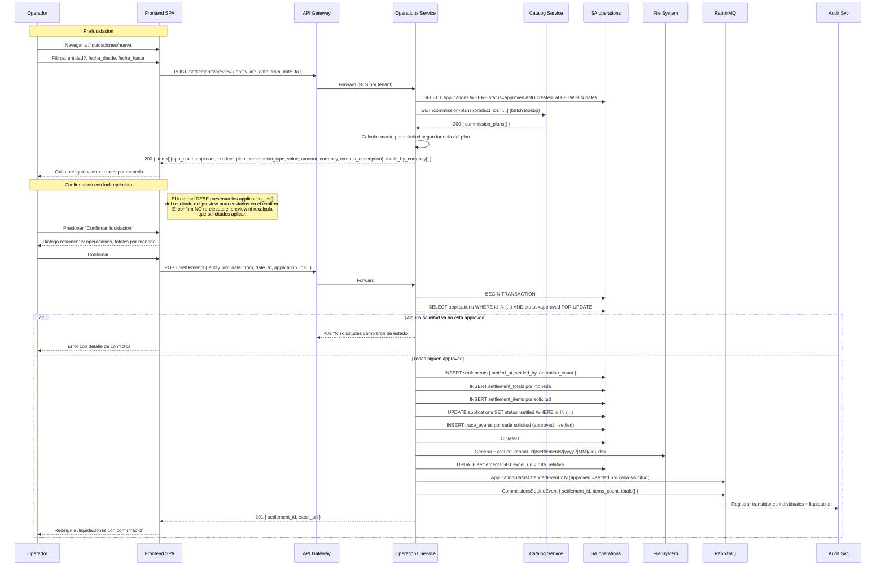
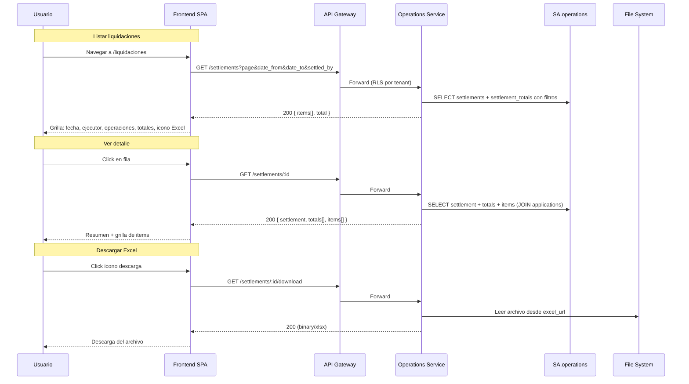

# FL-OPS-02 — Liquidar Comisiones

> **Dominio:** Operations
> **Version:** 1.0.0
> **HUs:** HU035, HU036

---

## 1. Objetivo

Ejecutar la liquidacion masiva de comisiones sobre solicitudes aprobadas: preliquidacion con calculo estimado, confirmacion con lock optimista, generacion de reporte Excel, y consulta de historial.

## 2. Alcance

**Dentro:**
- Preliquidacion con filtros (entidad, rango de fechas) y calculo estimado por solicitud.
- Grilla con desglose: comision, formula aplicada, monto, moneda.
- Totales agrupados por moneda.
- Confirmacion con lock optimista (verificar status = approved al confirmar).
- Creacion de settlement + settlement_totals + settlement_items.
- Transicion de solicitudes a status `settled`.
- Generacion de reporte Excel en filesystem.
- Historial de liquidaciones con filtros y detalle.
- Descarga de reportes Excel.

**Fuera:**
- Motor de calculo de comisiones (usa datos de commission_plans en Catalog).
- Reverso de liquidaciones (no contemplado en MVP).
- Notificaciones automaticas post-liquidacion (cubierto en FL-OPS-03 / Notification Service).

## 3. Actores y Ownership

| Actor | Rol en el flujo |
|-------|----------------|
| Operador | Ejecuta preliquidacion y confirma |
| Admin Entidad / Super Admin | Mismo acceso + puede ver todas las liquidaciones |
| Consulta / Auditor | Solo lectura (historial, detalle, descarga) |
| Operations Service | Calcula comisiones, persiste settlements, genera Excel |
| Catalog Service | Provee datos de commission_plans (lookup sync) |
| Audit Service | Registra liquidacion via evento async |
| Notification Service | Consume `CommissionsSettledEvent` para despachar notificaciones post-liquidacion al proveedor externo (consumo opcional, no bloquea el flujo) |

## 4. Precondiciones

- Operations Service y SA.operations operativos.
- Al menos una solicitud en status `approved` dentro del rango seleccionado.
- Commission plans configurados en Catalog para los productos/planes involucrados.
- Directorio de almacenamiento `{STORAGE_ROOT}/{tenant_id}/settlements/` accesible (solo requerido a partir de la confirmacion/generacion Excel, no para el preview).

## 5. Postcondiciones

- Settlement creado con `settled_at`, `settled_by`, `operation_count`.
- Settlement_totals creados por moneda.
- Settlement_items creados por cada solicitud liquidada.
- Solicitudes involucradas transicionan a status `settled`.
- Reporte Excel generado en `{STORAGE_ROOT}/{tenant_id}/settlements/{yyyy}/{MM}/{settlement_id}.xlsx`.
- CommissionsSettledEvent publicado via RabbitMQ.

## 6. Secuencia Principal — Preliquidacion y Confirmacion

## 7. Secuencia — Historial y Detalle

## 8. Secuencias Alternativas

### 8a. Sin Solicitudes Candidatas

| Condicion | Resultado |
|-----------|-----------|
| Filtro no retorna solicitudes approved | Mensaje informativo "No hay solicitudes para liquidar en el rango seleccionado" |
| Todas las solicitudes ya fueron liquidadas | Mismo mensaje |

### 8b. Conflicto de Concurrencia (Lock Optimista)

| Paso | Detalle |
|------|---------|
| 1 | Al confirmar, SELECT ... FOR UPDATE verifica status actual |
| 2 | Si alguna solicitud cambio de estado, 409 con lista de conflictos |
| 3 | Frontend muestra detalle de solicitudes en conflicto |
| 4 | Operador debe volver a preliquidar para obtener lista actualizada |

### 8c. Error en Generacion de Excel

| Paso | Detalle |
|------|---------|
| 1 | Si falla escritura a filesystem, settlement se crea igual (datos en DB) |
| 2 | excel_url queda NULL; se muestra advertencia "Reporte no disponible" |
| 3 | Reintento manual posible via endpoint dedicado (futuro) |

## 9. Slice de Arquitectura

- **Servicio owner:** Operations Service (.NET 10, SA.operations)
- **Comunicacion sync:** SPA → Gateway → Operations; Operations → Catalog (lookup commission_plans)
- **Comunicacion async:** Operations → RabbitMQ → Audit, Notification
- **Storage:** Filesystem local para reportes Excel (`{STORAGE_ROOT}/{tenant_id}/settlements/`)
- **RLS:** `settlements`, `settlement_items` filtrados por tenant_id
- **Lock optimista:** SELECT ... FOR UPDATE dentro de transaccion al confirmar

## 10. Data Touchpoints

| Entidad | Operacion | Evento |
|---------|-----------|--------|
| `settlements` | INSERT | CommissionsSettledEvent |
| `settlement_totals` | INSERT | — (incluido en CommissionsSettled) |
| `settlement_items` | INSERT | — (incluido en CommissionsSettled) |
| `applications` | UPDATE (status→settled) | ApplicationStatusChangedEvent (por cada una) |
| `trace_events` | INSERT (por cada solicitud) | — |
| `commission_plans` (Catalog) | SELECT (lookup) | — |

**Estados:** approved → settled (unica transicion en este flujo)

## 11. RF Candidatos para `04_RF.md`

| RF final | Descripcion | Origen FL |
|----------|-------------|-----------|
| RF-OPS-12 | Preliquidacion con filtros y calculo estimado | Seccion 6 |
| RF-OPS-13 | Confirmacion de liquidacion con lock optimista | Seccion 6 |
| RF-OPS-14 | Generacion de reporte Excel post-confirmacion | Seccion 6 |
| RF-OPS-16 | Listar historial de liquidaciones con filtros | Seccion 7 |
| RF-OPS-17 | Ver detalle de liquidacion con items | Seccion 7 |
| RF-OPS-18 | Descargar reporte Excel de liquidacion | Seccion 7 |

> **Nota:** Los IDs de RF candidatos originales (RF-OPS-09 a RF-OPS-14) fueron reasignados durante la consolidacion en RF-OPS.md. Los RF-OPS-09 a RF-OPS-11 corresponden a funcionalidades de FL-OPS-01 (beneficiarios, documentos, observaciones). Esta tabla refleja los IDs finales.

## 12. Riesgos y Mitigaciones

| Riesgo | Impacto | Mitigacion |
|--------|---------|------------|
| Concurrencia: solicitud cambia de estado entre preview y confirm | Alto | Lock optimista con FOR UPDATE; 409 con detalle de conflictos |
| Calculo incorrecto de comisiones | Alto | Formulas inmutables en commission_plans; preliquidacion muestra formula legible para verificacion |
| Filesystem no disponible para Excel | Medio | Settlement se persiste igual; Excel queda pendiente; advertencia al usuario |
| Volumetria alta (muchas solicitudes en un rango) | Medio | Paginacion en preview; transaccion batch en confirm; timeout configurado |
| Catalog no responde al consultar commission_plans | Medio | Retry + 503; datos de comision son obligatorios para calcular |

## 13. RF Handoff Checklist

- [x] Actor ownership explicito en cada paso.
- [x] Diagramas explican el flujo sin prosa larga.
- [x] Riesgos y mitigaciones documentados.
- [x] Traducible a RF atomicos y testeables.
- [x] Dentro del limite de 2 paginas.
- [x] Sin dependencias criticas desconocidas.
