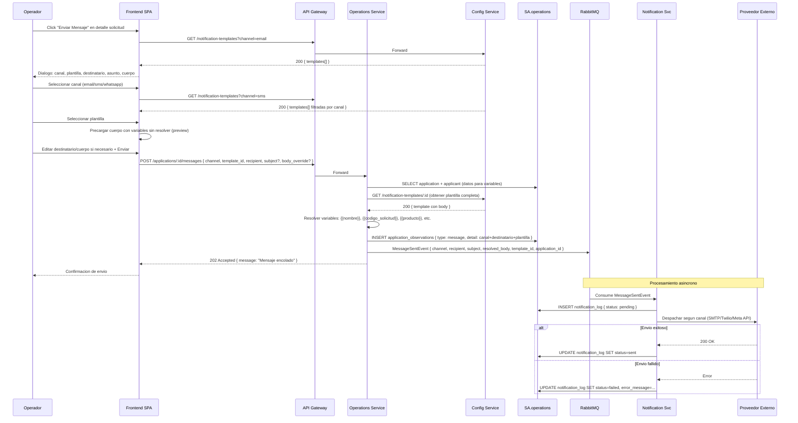

# FL-OPS-03 — Enviar Mensaje desde Solicitud

> **Dominio:** Operations
> **Version:** 1.0.0
> **HUs:** HU037

---

## 1. Objetivo

Permitir al operador enviar mensajes (email, SMS, WhatsApp) al solicitante desde el detalle de una solicitud, usando plantillas con variables resueltas, y registrar automaticamente una observacion con el detalle del envio. El envio es siempre asincrono: el endpoint retorna `202 Accepted` inmediatamente, independientemente del estado del proveedor externo. El resultado del despacho (sent/failed) queda en `notification_log` de SA.notification (RN-OPS-17).

## 2. Alcance

**Dentro:**
- Dialogo de envio con seleccion de canal, plantilla y destinatario.
- Resolucion de variables de plantilla ({{nombre}}, {{codigo_solicitud}}, etc.) en Operations Service.
- Publicacion de MessageSentEvent via RabbitMQ.
- Registro automatico de observacion en la solicitud.
- Feedback de estado del envio (sent/failed/pending).

**Fuera:**
- Configuracion de proveedores externos (SMTP, Twilio, Meta) — gestionado en FL-CFG-01.
- Motor de despacho de notificaciones (Notification Service es consumer).
- Plantillas de notificacion CRUD (gestionado en Config Service).

## 3. Actores y Ownership

| Actor | Rol en el flujo |
|-------|----------------|
| Operador | Selecciona canal, plantilla, edita mensaje, envia |
| Admin Entidad / Super Admin | Mismo acceso |
| Operations Service | Resuelve variables, publica evento, crea observacion |
| Config Service | Provee plantillas de notificacion (lookup sync) |
| Notification Service | Consume MessageSentEvent, despacha al proveedor, actualiza estado |
| Audit Service | Registra envio via evento async |

## 4. Precondiciones

- Operations Service y SA.operations operativos.
- Solicitud existente con solicitante que tiene al menos un contacto.
- Plantillas de notificacion configuradas en Config Service.
- Proveedor externo configurado para el canal seleccionado (SMTP, Twilio, Meta).

## 5. Postcondiciones

- MessageSentEvent publicado con mensaje ya resuelto (sin variables).
- Observacion creada en `application_observations` con detalle del envio.
- Notification Service registra resultado en `notification_log` (sent/failed/pending).

## 6. Secuencia Principal — Enviar Mensaje

## 7. Secuencias Alternativas

### 7a. Sin Contactos del Solicitante

| Condicion | Resultado |
|-----------|-----------|
| Solicitante sin contactos | Destinatario vacio; operador debe ingresar manualmente |
| Solicitante sin email pero canal=email | Advertencia "Sin email registrado"; campo editable |

### 7b. Plantilla sin Variables

| Paso | Detalle |
|------|---------|
| 1 | Si la plantilla no tiene variables ({{...}}), el cuerpo se usa tal cual |
| 2 | Operador puede editar el cuerpo antes de enviar |

### 7c. Body Override (RN-OPS-18)

| Paso | Detalle |
|------|---------|
| 1 | Si el operador edita el cuerpo del mensaje antes de enviar, el frontend envia `body_override` en el POST |
| 2 | Cuando `body_override` se provee, Operations **no resuelve variables** de la plantilla |
| 3 | El `body_override` se usa como cuerpo final tal cual en el `MessageSentEvent` |
| 4 | La plantilla se sigue requiriendo (para canal, titulo, y registro de observacion) pero su body se ignora |

### 7d. Proveedor Externo No Disponible

| Paso | Detalle |
|------|---------|
| 1 | Notification Service intenta enviar y recibe error |
| 2 | notification_log queda como `failed` con error_message |
| 3 | MassTransit retry (3 intentos con backoff) antes de mover a DLQ |
| 4 | No se notifica al operador en tiempo real (puede consultar en observaciones/log) |

### 7e. Multiples Destinatarios

| Paso | Detalle |
|------|---------|
| 1 | Cada envio es individual (un mensaje = un destinatario) |
| 2 | Para enviar al mismo solicitante por multiples canales, repetir la accion |

## 8. Slice de Arquitectura

- **Servicio owner:** Operations Service (.NET 10, SA.operations) — resolucion de variables y publicacion
- **Consumer:** Notification Service — despacho al proveedor externo
- **Comunicacion sync:** SPA → Gateway → Operations; Operations → Config (lookup plantillas)
- **Comunicacion async:** Operations → RabbitMQ → Notification, Audit
- **Patron:** Operations resuelve template + publica evento con cuerpo resuelto (D-OPS-03); Notification solo despacha

## 9. Data Touchpoints

| Entidad | Operacion | Evento |
|---------|-----------|--------|
| `application_observations` (SA.operations) | INSERT | — |
| `notification_templates` (SA.config) | SELECT (lookup) | — |
| `notification_log` (SA.notification) | INSERT, UPDATE (status) | — |
| — | — | MessageSentEvent (Operations → bus) |

## 10. RF Candidatos para `04_RF.md`

| RF final | Descripcion | Origen FL |
|----------|-------------|-----------|
| RF-OPS-15 | Enviar mensaje desde solicitud con resolucion de variables de plantilla | Seccion 6 |

> **Nota de consolidacion:** Los 4 RF candidatos originales (RF-OPS-15 a RF-OPS-18) fueron consolidados en un unico RF-OPS-15 en RF-OPS.md v2.0.0. RF-OPS-16 (resolucion de variables) y RF-OPS-17 (auto-observacion) son pasos internos del RF-OPS-15, no comportamientos separados. RF-OPS-18 (despacho asincrono) es responsabilidad de Notification Service, fuera de alcance de Operations. Los IDs RF-OPS-16, RF-OPS-17 y RF-OPS-18 en RF-OPS.md corresponden ahora a funcionalidades de liquidaciones (FL-OPS-02).

## 11. Riesgos y Mitigaciones

| Riesgo | Impacto | Mitigacion |
|--------|---------|------------|
| Plantilla con variable no resuelta (dato faltante) | Medio | Validar variables disponibles antes de enviar; mostrar preview con datos reales |
| Proveedor externo caido | Medio | MassTransit retry + DLQ; notification_log registra estado failed |
| Mensaje enviado con datos incorrectos | Alto | Preview del mensaje resuelto antes de confirmar envio |
| Destinatario invalido (email/telefono mal formado) | Bajo | Validacion basica de formato en frontend y backend |

## 12. RF Handoff Checklist

- [x] Actor ownership explicito en cada paso.
- [x] Diagramas explican el flujo sin prosa larga.
- [x] Riesgos y mitigaciones documentados.
- [x] Traducible a RF atomicos y testeables.
- [x] Dentro del limite de 1 pagina.
- [x] Sin dependencias criticas desconocidas.
