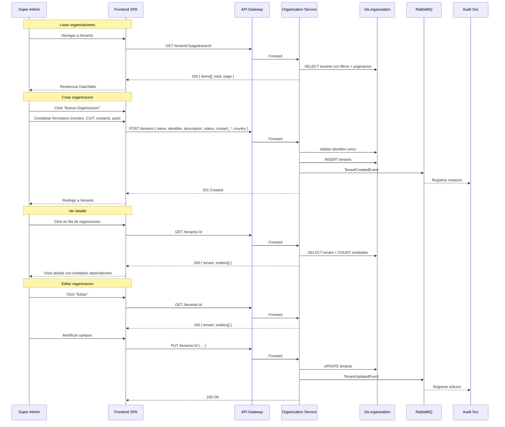

# FL-ORG-01 — Gestionar Organizaciones

> **Dominio:** Organization
> **Version:** 1.0.0
> **HUs:** HU002, HU003, HU004

---

## 1. Objetivo

Permitir al Super Admin crear, editar, consultar y eliminar organizaciones (tenants), que son la raiz del arbol jerarquico multi-tenant del sistema.

## 2. Alcance

**Dentro:**
- Listar organizaciones con busqueda, filtros y exportacion.
- Crear y editar organizaciones con datos de contacto.
- Ver detalle de organizacion con entidades asociadas.
- Eliminar organizacion (solo si no tiene entidades).
- Grilla de entidades dependientes en formulario de edicion.

**Fuera:**
- Gestion de entidades y sucursales (ver FL-ORG-02).
- Configuracion de tenant (branding, parametros propios).
- Migracion de datos entre organizaciones.

## 3. Actores y Ownership

| Actor | Rol en el flujo |
|-------|----------------|
| Super Admin | CRUD completo de organizaciones |
| Admin Entidad / Auditor / Consulta | Solo lectura (listar, ver detalle) |
| Organization Service | Persiste tenants en SA.organization |
| Audit Service | Registra cambios via eventos async |

## 4. Precondiciones

- Organization Service y SA.organization operativos.
- Super Admin autenticado con permisos del modulo organizacion (`p_org_create`, `p_org_edit`, `p_org_delete`, `p_org_list`, `p_org_detail` — ver detalle de permisos granulares en RF-ORG).

## 5. Postcondiciones

- Organizacion creada: registro en `tenants`, TenantCreatedEvent publicado.
- Organizacion editada: registro actualizado, TenantUpdatedEvent publicado.
- Organizacion eliminada: registro eliminado fisicamente (solo si sin entidades), TenantDeletedEvent publicado.

## 6. Secuencia Principal

## 7. Secuencias Alternativas

### 7a. Eliminar Organizacion

| Paso | Accion | Resultado |
|------|--------|-----------|
| 1 | Super Admin presiona "Eliminar" en la grilla | SPA muestra dialogo de confirmacion |
| 2 | Confirma eliminacion | DELETE /tenants/:id |
| 3a | Organizacion sin entidades | DELETE fisico + TenantDeletedEvent → Audit |
| 3b | Organizacion con entidades | 409 "No se puede eliminar: tiene N entidades asociadas" |

### 7b. Exportacion

| Formato | Accion |
|---------|--------|
| Excel (.xlsx) | GET /tenants/export?format=xlsx&filters... |
| CSV | GET /tenants/export?format=csv&filters... |

## 8. Slice de Arquitectura

- **Servicio owner:** Organization Service (.NET 10, SA.organization)
- **Comunicacion sync:** SPA → API Gateway → Organization Service
- **Comunicacion async:** Organization → RabbitMQ → Audit Service
- **Nota RLS:** `tenants` no lleva RLS (el tenant_id ES el id de la fila; acceso por claim del JWT)

## 9. Data Touchpoints

| Entidad | Operacion | Evento |
|---------|-----------|--------|
| `tenants` | INSERT, UPDATE, DELETE | TenantCreatedEvent, TenantUpdatedEvent, TenantDeletedEvent |
| `entities` | SELECT (verificacion en delete, listado en detalle) | — |
| `audit_log` (SA.audit) | INSERT (async) | Consume eventos via RabbitMQ |

**Estados relevantes:**
- `tenant_status`: active, inactive

## 10. RF Candidatos para `04_RF.md`

| RF ID | Descripcion | Origen FL |
|-------------|-------------|-----------|
| RF-ORG-01 | Listar organizaciones con busqueda, filtros y exportacion | Seccion 6 |
| RF-ORG-02 | Crear organizacion con datos de contacto | Seccion 6 |
| RF-ORG-03 | Editar organizacion con entidades dependientes | Seccion 6 |
| RF-ORG-04 | Ver detalle de organizacion con entidades dependientes | Seccion 6 |
| RF-ORG-05 | Eliminar organizacion con validacion de dependencias | Seccion 7a |

## 11. Riesgos y Mitigaciones

| Riesgo | Impacto | Mitigacion |
|--------|---------|------------|
| Eliminacion de organizacion con datos en otros servicios | Alto | Solo eliminar si sin entidades; entidades son el gateway a otros datos |
| CUIT duplicado | Medio | Indice UNIQUE en identifier; validacion al crear/editar |
| Organizacion inactiva con entidades activas | Bajo | UI puede advertir; no se bloquea (admin decide) |

## 12. RF Handoff Checklist

- [x] Actor ownership explicito en cada paso.
- [x] Diagramas explican el flujo sin prosa larga.
- [x] Riesgos y mitigaciones documentados.
- [x] Traducible a RF atomicos y testeables.
- [x] Dentro del limite de 1 pagina.
- [x] Sin dependencias criticas desconocidas.
