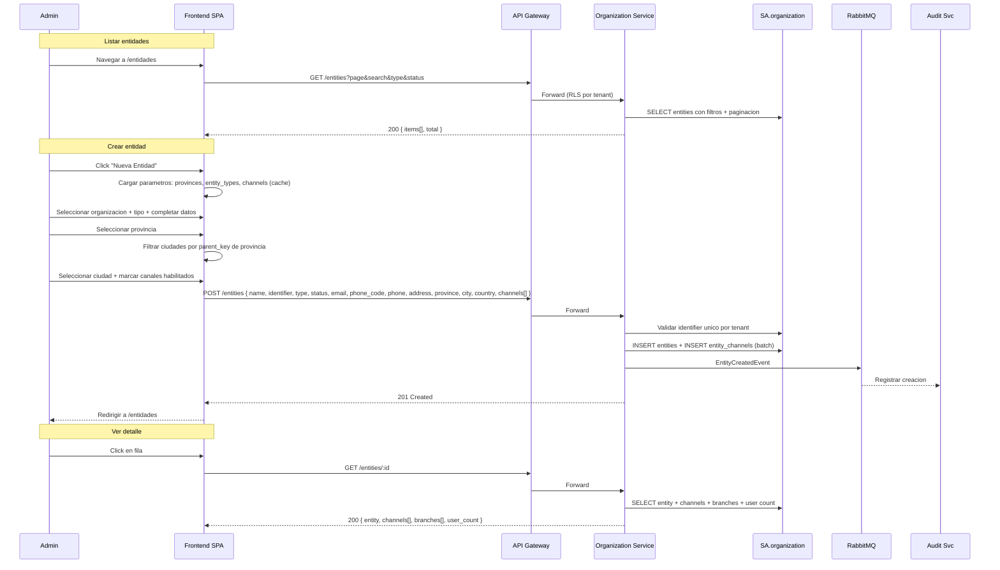
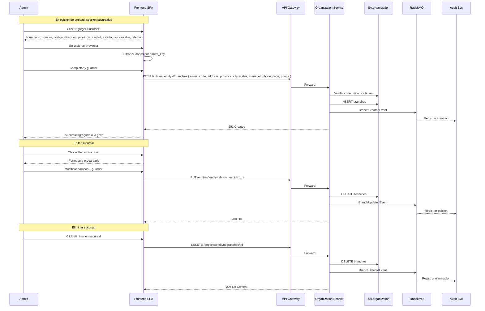

# FL-ORG-02 — Gestionar Entidades y Sucursales

> **Dominio:** Organization
> **Version:** 1.0.0
> **HUs:** HU005, HU006, HU007, HU008

---

## 1. Objetivo

Permitir la gestion completa de entidades financieras (bancos, aseguradoras, fintechs, cooperativas, SGRs, tarjetas regionales) y sus sucursales, incluyendo canales habilitados y selects parametrizados en cascada.

## 2. Alcance

**Dentro:**
- Listar entidades con filtros, busqueda y exportacion.
- Crear y editar entidades con tipo, canales, provincia/ciudad en cascada.
- Ver detalle de entidad con sucursales y usuarios asignados.
- CRUD de sucursales dentro de una entidad.
- Eliminacion de entidades (solo sin sucursales) o desactivacion.

**Fuera:**
- Gestion de organizaciones (ver FL-ORG-01).
- Configuracion de canales por entidad (solo habilitacion on/off).
- Arbol organizacional visual (mencionado en alcance, fuera del MVP detallado).

## 3. Actores y Ownership

| Actor | Rol en el flujo |
|-------|----------------|
| Super Admin | CRUD completo de entidades y sucursales de cualquier organizacion |
| Admin Entidad | CRUD de entidades y sucursales de su organizacion |
| Consulta / Auditor / Operador | Solo lectura (listar, ver detalle) |
| Organization Service | Persiste entidades, canales y sucursales |
| Config Service | Provee parametros: provinces, cities, entity_types, channels (via cache) |
| Audit Service | Registra cambios via eventos async |

## 4. Precondiciones

- Organization Service y SA.organization operativos.
- Al menos una organizacion activa (para asociar entidades).
- Parametros cargados: `provinces`, `cities` (con parent_key), `entity_types`, `channels`.

## 5. Postcondiciones

- Entidad creada: registro en `entities` + `entity_channels`, EntityCreatedEvent publicado.
- Entidad editada: registros actualizados, EntityUpdatedEvent publicado.
- Entidad sin sucursales eliminada: DELETE fisico + EntityDeletedEvent.
- Entidad con sucursales desactivada: status = inactive/suspended + EntityUpdatedEvent.
- Sucursal creada/editada/eliminada: registros en `branches`, BranchCreatedEvent/BranchUpdatedEvent/BranchDeletedEvent.

## 6. Secuencia Principal — Entidades

## 7. Secuencia — Sucursales

## 8. Secuencias Alternativas

### 8a. Eliminar / Desactivar Entidad

| Condicion | Resultado |
|-----------|-----------|
| Entidad sin sucursales | Eliminacion fisica + EntityDeletedEvent (HTTP 204) |
| Entidad con sucursales | HTTP 409 — informa `"Entidad tiene N sucursal(es). Solo se puede desactivar."` El admin debe desactivar via PUT /entities/:id (edicion de status) |

### 8b. Selects en Cascada (provincia → ciudad)

| Paso | Detalle |
|------|---------|
| 1 | Frontend carga provincias desde parametros (cache Config) |
| 2 | Al seleccionar provincia, filtra ciudades por `parent_key` |
| 3 | Mismo patron en entidad y sucursal |

### 8c. Canales Habilitados

| Paso | Detalle |
|------|---------|
| 1 | Checkboxes cargados desde parametro `channels` |
| 2 | Al guardar, se sincronizan en `entity_channels` (diff: insert nuevos, delete desmarcados) |

## 9. Slice de Arquitectura

- **Servicio owner:** Organization Service (.NET 10, SA.organization)
- **Comunicacion sync:** SPA → API Gateway → Organization Service
- **Comunicacion async:** Organization → RabbitMQ → Audit Service
- **Parametros:** Config Service provee provinces, cities, entity_types, channels (cache Redis)
- **RLS:** aplica a `entities`, `entity_channels`, `branches`

## 10. Data Touchpoints

| Entidad | Operacion | Evento |
|---------|-----------|--------|
| `entities` | INSERT, UPDATE, DELETE | EntityCreatedEvent, EntityUpdatedEvent, EntityDeletedEvent |
| `entity_channels` | INSERT, DELETE (sync con entidad) | — (incluido en Entity events) |
| `branches` | INSERT, UPDATE, DELETE | BranchCreatedEvent, BranchUpdatedEvent, BranchDeletedEvent |
| `audit_log` (SA.audit) | INSERT (async) | Consume eventos via RabbitMQ |

**Estados relevantes:**
- `entity_status`: active → inactive / suspended (entidades con sucursales no se eliminan)
- `entity_status` en branches: active, inactive, suspended (independiente de la entidad)

## 11. RF Candidatos para `04_RF.md`

| RF ID | Descripcion | Origen FL |
|-------------|-------------|-----------|
| RF-ORG-06 | Listar entidades con filtros, busqueda y exportacion | Seccion 6 |
| RF-ORG-07 | Crear/editar entidad con tipo, canales y selects en cascada | Seccion 6 |
| RF-ORG-08 | Ver detalle de entidad con sucursales y usuarios | Seccion 6 |
| RF-ORG-09 | Eliminar/desactivar entidad con validacion de dependencias | Seccion 8a |
| RF-ORG-10 | CRUD de sucursales con selects en cascada | Seccion 7 |

## 12. Riesgos y Mitigaciones

| Riesgo | Impacto | Mitigacion |
|--------|---------|------------|
| Entidad eliminada referenciada en Catalog/Identity | Alto | Solo eliminar sin sucursales; datos denormalizados en otros servicios; EntityDeletedEvent para limpieza eventual |
| Parametros de provincias/ciudades no cargados | Medio | Fallback a input text libre; seed data obligatorio |
| CUIT duplicado por tenant | Medio | Indice UNIQUE (tenant_id, identifier); validacion al crear/editar |
| Canal deshabilitado pero usado en solicitudes existentes | Bajo | Deshabilitar canal no afecta solicitudes ya creadas; solo nuevas |

## 13. RF Handoff Checklist

- [x] Actor ownership explicito en cada paso.
- [x] Diagramas explican el flujo sin prosa larga.
- [x] Riesgos y mitigaciones documentados.
- [x] Traducible a RF atomicos y testeables.
- [x] Dentro del limite de 2 paginas.
- [x] Sin dependencias criticas desconocidas.
