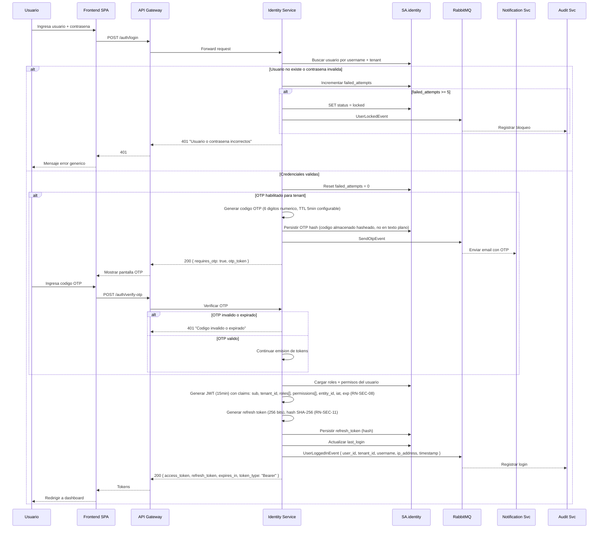
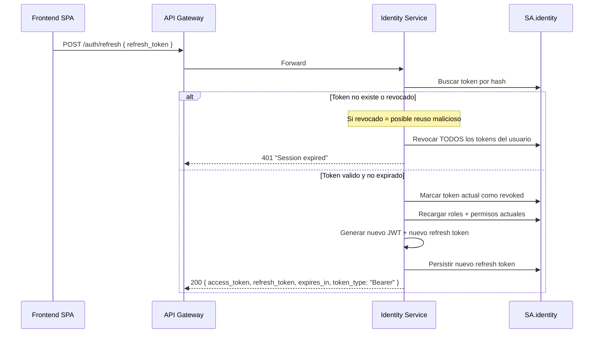
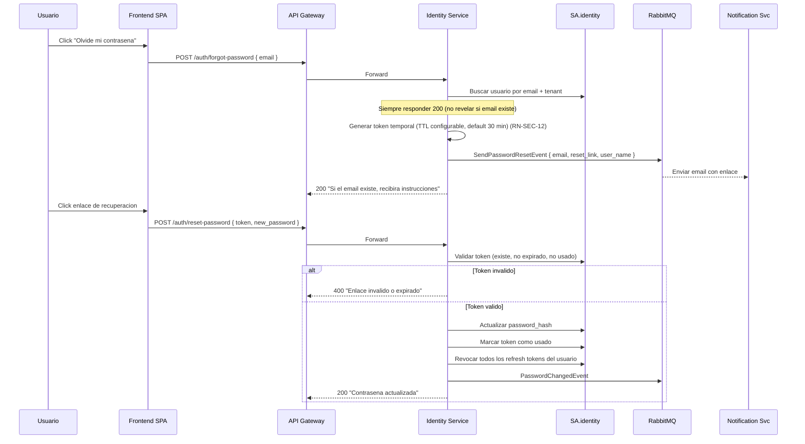
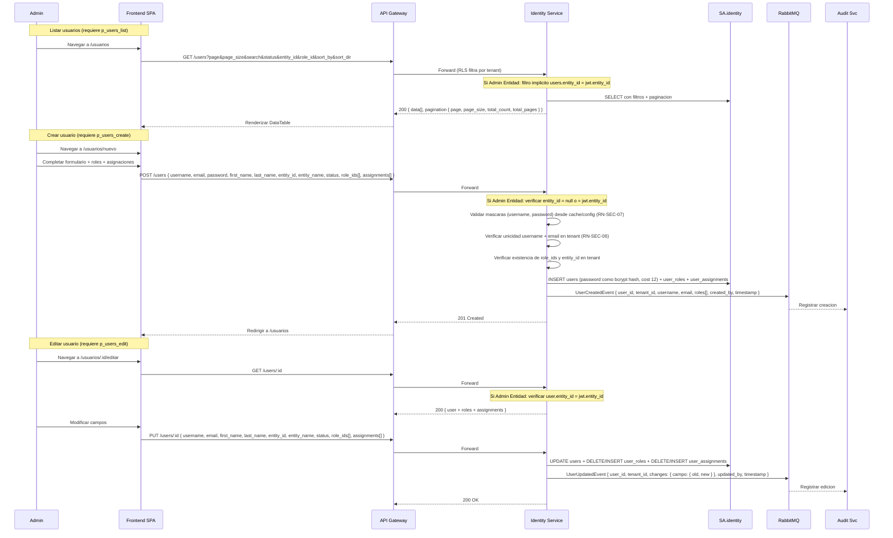

# FL-SEC-01 — Autenticacion y Gestion de Usuarios

> **Dominio:** Identity
> **Version:** 1.2.0
> **HUs:** HU023, HU024, HU025, HU038

---

## 1. Objetivo

Permitir que los usuarios se autentiquen de forma segura, gestionen sesiones y que los administradores realicen CRUD de cuentas de usuario con asignaciones jerarquicas.

## 2. Alcance

**Dentro:**
- Login con usuario/contrasena + OTP opcional.
- Emision y rotacion de JWT + refresh token.
- Bloqueo permanente tras 5 intentos fallidos.
- Recuperacion de contrasena via email con enlace temporal.
- Logout con revocacion de refresh token.
- CRUD de usuarios (crear, editar, listar, ver detalle).
- Asignaciones jerarquicas (organization, entity, branch).

**Fuera:**
- SSO/OAuth federado (evolucion futura).
- MFA por app authenticator (solo OTP por email en MVP).
- Auto-registro de usuarios (solo admin puede crear cuentas).

## 3. Actores y Ownership

| Actor | Rol en el flujo |
|-------|----------------|
| Usuario (cualquier rol autenticable) | Se autentica (RF-SEC-01), verifica OTP (RF-SEC-02), cierra sesion (RF-SEC-05) |
| Usuario no autenticado | Recupera contrasena (RF-SEC-04) |
| Super Admin | CRUD completo de usuarios (RF-SEC-06/07/08), desbloqueo de cuentas |
| Admin Entidad | CRUD de usuarios de su entidad (RF-SEC-06/07/08), restringido por `entity_id` del JWT |
| Identity Service | Valida credenciales, emite JWT, gestiona tokens |
| Notification Service | Envia OTP y enlace de recuperacion por email |
| Frontend SPA | Ejecuta acciones automaticas en nombre del usuario (refresh token per RF-SEC-03, redirect, limpieza de estado local) |
| Audit Service | Registra login, logout, bloqueo, CRUD de usuarios |

## 4. Precondiciones

- Identity Service y SA.identity operativos.
- Tabla `users` con al menos un registro activo (seed inicial ejecutado).
- Tabla `permissions` inicializada con 88 permisos atomicos en 15 modulos (seed data).
- Roles predefinidos creados (7 roles seed en tabla `roles` con `is_system = true`).
- RabbitMQ operativo (para eventos async: UserLoggedInEvent, UserLockedEvent, SendOtpEvent, SendPasswordResetEvent, PasswordChangedEvent, UserLoggedOutEvent, UserCreatedEvent, UserUpdatedEvent).
- Parametros `mask.username` y `mask.password` disponibles en Config Service (con fallback via cache Redis y regex hardcodeada si Config no responde: username `^[a-zA-Z0-9._-]{3,30}$`, password `^.{8,}$`).
- Config Service accesible (consulta sync via cache Redis para mascaras de validacion).
- Notification Service operativo con plantillas de email OTP y recuperacion configuradas.
- Parametro de TTL de reset token configurado (default: 30 minutos).
- Parametro de TTL de refresh token configurado (default: 7 dias).

## 4b. Reglas de Negocio Aplicables (RF-SEC)

| RN | Regla | Seccion FL |
|----|-------|-----------|
| RN-SEC-01 | Bloqueo permanente tras 5 intentos fallidos (solo Super Admin desbloquea) | 6, 6a |
| RN-SEC-02 | Rotacion estricta de refresh token (reuso revoca toda la cadena) | 7a |
| RN-SEC-03 | Propagacion de permisos al refresh (no en JWT activo) | 7a, 8 |
| RN-SEC-04 | Mensaje de error generico en login (no revelar si usuario o contrasena) | 6 |
| RN-SEC-05 | Respuesta opaca en forgot-password (siempre 200) | 7b |
| RN-SEC-06 | Unicidad de username y email por tenant | 8 |
| RN-SEC-07 | Validacion de mascaras dinamicas (Config Service con fallback) | 6, 8 |
| RN-SEC-08 | JWT claims obligatorios: sub, tenant_id, roles[], permissions[], entity_id, iat, exp (15 min) | 6 |
| RN-SEC-09 | Cuenta inactiva no puede autenticarse (sin incrementar intentos) | 6a |
| RN-SEC-10 | Cuenta bloqueada no puede autenticarse (sin incrementar intentos) | 6a |
| RN-SEC-11 | Hash SHA-256 de refresh token (valor en claro se envia una sola vez) | 6, 7a |
| RN-SEC-12 | Token de recuperacion de un solo uso (TTL default 30 min) | 7b |

## 5. Postcondiciones

- Login exitoso: JWT emitido con claims (`sub`, `tenant_id`, `roles[]`, `permissions[]`, `entity_id`, `iat`, `exp`) (RN-SEC-08), refresh token persistido como hash SHA-256 (RN-SEC-11).
- Login fallido 5 veces: cuenta bloqueada (`status = locked`), evento UserLockedEvent publicado (RN-SEC-01).
- Usuario creado/editado: registro persistido con asignaciones y roles, evento UserCreatedEvent/UserUpdatedEvent publicado. Contrasena almacenada como bcrypt hash (cost factor 12).
- Logout: refresh token revocado, estado local limpio, UserLoggedOutEvent publicado.
- Recuperacion de contrasena: password_hash actualizado, `failed_attempts` reseteado a 0, todos los refresh tokens revocados, PasswordChangedEvent publicado.

## 6. Secuencia Principal — Autenticacion

### 6a. Validaciones previas al login

| Paso | Condicion | Resultado |
|------|-----------|-----------|
| 1 | tenant_id invalido o inexistente | 400 AUTH_TENANT_NOT_FOUND |
| 2 | username o password vacios / username no cumple formato | 422 AUTH_VALIDATION_ERROR |
| 3 | users.status = locked | 403 AUTH_ACCOUNT_LOCKED (sin incrementar failed_attempts) (RN-SEC-10) |
| 4 | users.status = inactive | 403 AUTH_ACCOUNT_INACTIVE (sin incrementar failed_attempts) (RN-SEC-09) |
| 5 | Credenciales invalidas | 401 AUTH_INVALID_CREDENTIALS (incrementa failed_attempts) (RN-SEC-04: mensaje generico) |
| 6 | failed_attempts >= 5 post-check | SET status = locked → 403 AUTH_MAX_ATTEMPTS_REACHED + UserLockedEvent (RN-SEC-01) |

### 6a-bis. Notas de seguridad del login (RF-SEC-01)

- **Concurrencia en failed_attempts:** Se usa `UPDATE users SET failed_attempts = failed_attempts + 1 WHERE id = :id RETURNING failed_attempts` para evitar race conditions.
- **Timing attack:** Si el usuario no existe, se ejecuta igualmente un bcrypt verify contra un hash dummy para mantener tiempo de respuesta constante.
- **Orden de validacion:** 1) Existencia del usuario, 2) Estado (locked/inactive se rechazan sin incrementar intentos), 3) Contrasena.
- **OTP habilitado:** Si el parametro de tenant indica OTP habilitado, RF-SEC-01 NO emite tokens finales; retorna `{ requires_otp: true, otp_token }` y delega emision a RF-SEC-02.
- **tenant_id:** Se resuelve desde header `X-Tenant-Id` o subdominio (no del body). Se activa RLS con `SET LOCAL app.current_tenant`.

### 6b. Resend y limites OTP

| Paso | Detalle |
|------|---------|
| 1 | Usuario click "Reenviar codigo" → SPA: POST /auth/resend-otp { otp_token } |
| 2 | Identity Service invalida OTP previo, genera nuevo, publica SendOtpEvent |
| 3 | Maximo 3 reenvios por sesion OTP. Despues: 403 OTP_RESEND_LIMIT |
| 4 | Si otp_attempts >= 3 verificaciones fallidas → invalida otp_token → 403 OTP_MAX_ATTEMPTS → usuario debe reiniciar login |

**Errores tipados OTP (RF-SEC-02):**

| Codigo | HTTP | Condicion |
|--------|------|-----------|
| OTP_INVALID_CODE | 401 | Codigo incorrecto (mensaje: "Codigo invalido o expirado") |
| OTP_EXPIRED | 401 | TTL expirado (mismo mensaje que OTP_INVALID_CODE para no revelar causa) |
| OTP_TOKEN_INVALID | 401 | otp_token no encontrado o ya usado |
| OTP_MAX_ATTEMPTS | 403 | 3 intentos fallidos de verificacion |
| AUTH_VALIDATION_ERROR | 422 | otp_code no cumple formato de 6 digitos |

## 7. Secuencias Alternativas

### 7a. Refresh Token

> **Nota de seguridad:** Si dos pestañas del SPA intentan refresh simultaneamente con el mismo token, la primera tendra exito y la segunda detectara reuso (AUTH_TOKEN_REVOKED_REUSE), revocando toda la cadena. **Mitigacion:** El SPA debe serializar peticiones de refresh (mutex o cola) y compartir el token nuevo.

> **Verificacion de cuenta:** Despues de validar el refresh token, se verifica `users.status = active`. Si locked o inactive, se revoca el token actual y se retorna 403 (AUTH_ACCOUNT_LOCKED o AUTH_ACCOUNT_INACTIVE).

> **Errores tipados (RF-SEC-03):** `AUTH_TOKEN_EXPIRED` (401) si `expires_at <= NOW()`. `AUTH_TOKEN_REVOKED_REUSE` (401) si token ya revocado (se revocan TODOS los tokens del usuario). `AUTH_TOKEN_NOT_FOUND` (401) si hash no encontrado. `AUTH_ACCOUNT_LOCKED` (403) si cuenta bloqueada entre refreshes. `AUTH_ACCOUNT_INACTIVE` (403) si cuenta desactivada entre refreshes. TTL default del refresh token: 7 dias (configurable).

### 7b. Recuperacion de Contrasena

> **Anti-timing attack:** Si el email no existe, se ejecuta un delay artificial equivalente al tiempo esperado de generacion de token + publicacion RabbitMQ, luego se retorna 200. Esto evita inferir existencia de emails via latencia diferencial.

> **Usuario bloqueado/inactivo en recovery (RF-SEC-04):** Si el usuario tiene status `locked` o `inactive`, el enlace se genera y envia igualmente. Al completar el reset, la contrasena se actualiza pero el status no cambia — el usuario debera ser desbloqueado/activado por un admin para poder iniciar sesion.

> **Reset de intentos:** Al completar reset-password exitosamente, se resetea `users.failed_attempts = 0`. Si el usuario estaba locked, la contrasena se actualiza pero el status locked permanece — debe ser desbloqueado por un Super Admin.

> **Errores tipados (RF-SEC-04):** `RESET_TOKEN_INVALID` (400), `RESET_TOKEN_EXPIRED` (400) y `RESET_TOKEN_USED` (400) retornan el mismo mensaje al cliente: "Enlace invalido o expirado" (para no revelar causa exacta). `RESET_PASSWORD_INVALID` (422) si la nueva contrasena no cumple `mask.password`. `AUTH_VALIDATION_ERROR` (422) si email malformado en forgot-password. La nueva contrasena se valida contra `mask.password` de Config Service (fallback: `^.{8,}$`) (RN-SEC-07).

### 7c. Logout

| Paso | Accion | Servicio |
|------|--------|----------|
| 1 | Usuario presiona "Cerrar sesion" | SPA |
| 2 | POST /auth/logout { refresh_token } (requiere JWT en header Authorization) | API Gateway → Identity |
| 3 | Revocar refresh token en DB (verificar que `refresh_tokens.user_id` coincide con `user_id` del JWT) | Identity |
| 4 | Publicar UserLoggedOutEvent { user_id, tenant_id, timestamp, ip_address } | Identity → RabbitMQ |
| 5 | Retornar 200 (idempotente: si token ya revocado o inexistente, igualmente retorna 200) | Identity |
| 6 | Limpiar tokens del estado local | SPA |
| 7 | Redirigir a /login | SPA |

> **Limitacion JWT stateless:** El access_token (JWT) permanece valido hasta su expiracion natural (max 15 min). El logout solo revoca el refresh token y limpia el estado del SPA. Aceptado como limitacion del modelo JWT stateless.

> **Errores tipados (RF-SEC-05):** `AUTH_TOKEN_MISMATCH` (403) si el refresh token no pertenece al usuario del JWT. `AUTH_VALIDATION_ERROR` (422) si refresh_token vacio. Logout acepta JWT expirado (se decodifica sin verificar expiracion, pero se verifica la firma).

## 8. Secuencia Principal — CRUD Usuarios

> **Errores tipados CRUD (RF-SEC-06/07/08):**
> - `AUTH_FORBIDDEN` (403): sin permiso `p_users_list`, `p_users_create`, `p_users_edit` o `p_users_detail`.
> - `AUTH_UNAUTHORIZED` (401): JWT ausente o invalido.
> - `USERS_USERNAME_TAKEN` (409): username duplicado en el tenant (RN-SEC-06).
> - `USERS_EMAIL_TAKEN` (409): email duplicado en el tenant (RN-SEC-06).
> - `USERS_NOT_FOUND` (404): usuario inexistente en edicion o detalle.
> - `USERS_ENTITY_MISMATCH` (403): Admin Entidad intenta gestionar usuario de otra entidad.
> - `USERS_ENTITY_NOT_FOUND` (422): entidad inexistente o inactiva.
> - `USERS_ROLE_NOT_FOUND` (422): rol inexistente en el tenant.
> - `USERS_SCOPE_NOT_FOUND` (422): scope inexistente en asignaciones.
> - `USERS_MIN_ROLES` (422): array de roles vacio (minimo 1 rol requerido).
> - `USERS_EXPORT_LIMIT` (422): exportacion supera 10,000 filas.
> - `VALIDATION_ERROR` (422): campos invalidos (mascaras de username/password, paginacion, etc.).

> **Funcionalidades adicionales documentadas en RF:**
> - **Desbloqueo manual:** Super Admin cambia `users.status` de locked a active via `PUT /users/:id` (RF-SEC-07). Genera UserUpdatedEvent. La contrasena no se cambia en edicion (campo `password` solo en creacion).
> - **Vista detalle standalone:** `GET /users/:id` con permiso `p_users_detail` retorna permisos efectivos calculados en backend (`SELECT DISTINCT` sobre `role_permissions` JOIN `permissions`), roles con `{ id, name, description }`, y asignaciones (RF-SEC-08). Admin Entidad restringido a su entidad (403 USERS_ENTITY_MISMATCH si intenta ver usuario de otra entidad).
> - **Exportacion:** `GET /users?export=csv|xlsx` genera archivo sin paginacion, max 10,000 filas (RF-SEC-06). Error `USERS_EXPORT_LIMIT` (422) si supera el limite.
> - **Scope delete:** No existe DELETE /users/:id. La desactivacion se realiza via PUT cambiando status a inactive. Justificacion: integridad de audit trail.
> - **Contrasena solo en creacion:** El campo `password` es obligatorio en `POST /users` y no se incluye en `PUT /users/:id`. Para cambiar contrasena existe el flujo de recuperacion (RF-SEC-04).
> - **Reemplazo completo de roles y asignaciones:** En edicion, `role_ids` y `assignments` reemplazan completamente los existentes (estrategia DELETE + INSERT). El SPA debe enviar la lista completa.
> - **Propagacion de cambios de roles (RN-SEC-03):** Los cambios en roles se reflejan en el JWT del usuario afectado al proximo refresh token. No se fuerza logout.

## 9. Slice de Arquitectura

- **Servicio owner:** Identity Service (.NET 10, SA.identity)
- **Comunicacion sync:** SPA → API Gateway → Identity Service (HTTP/JSON)
- **Comunicacion async:** Identity → RabbitMQ → Audit Service, Notification Service
- **Autenticacion:** JWT Bearer en Gateway; Identity emite y valida tokens
- **RLS:** `users`, `user_assignments`, `roles`, `user_roles`, `role_permissions`, `refresh_tokens` filtrados por `tenant_id` (activado via `SET LOCAL app.current_tenant`)
- **Config Service** (consulta sync via cache Redis para mascaras de validacion; fallback a regex hardcodeada)
- **Cache:** Redis para parametros de mascaras y sesiones activas (opcional)

## 10. Data Touchpoints

| Entidad | Operacion | Evento |
|---------|-----------|--------|
| `users` | INSERT, UPDATE, SELECT | UserCreatedEvent, UserUpdatedEvent, UserLockedEvent, UserLoggedInEvent, PasswordChangedEvent |
| `user_roles` | INSERT, DELETE (sync) | — (incluido en UserCreated/Updated) |
| `user_assignments` | INSERT, DELETE (sync) | — (incluido en UserCreated/Updated) |
| `refresh_tokens` | INSERT, UPDATE (revoke) | UserLoggedOutEvent (al revocar en logout) |
| `audit_log` (SA.audit) | INSERT (async) | Consume eventos via RabbitMQ |
| `notification_log` (SA.notification) | INSERT (async) | Consume SendOtpEvent, SendPasswordResetEvent |
| `otp_store` (Redis o tabla temporal) | INSERT (generacion), SELECT + UPDATE (verificacion) | SendOtpEvent (al generar/reenviar) |
| `reset_token_store` (Redis o tabla temporal) | INSERT (forgot-password), SELECT + UPDATE (reset-password) | SendPasswordResetEvent (al generar enlace) |
| `permissions` | SELECT (login, OTP, refresh — hot-path para JWT claims) | — |
| `roles` | SELECT (login — catalogo read-only para JWT claims) | — |
| `role_permissions` | SELECT (login, OTP, refresh — resolucion de permisos efectivos) | — |

**Estados relevantes:**
- `user_status`: active → inactive, active → locked, locked → active (desbloqueo)
- `refresh_tokens.revoked`: false → true (rotacion o logout)

> **Nota:** `users.failed_attempts` — columna integer DEFAULT 0 pendiente de agregar al modelo (ver D-SEC-01). Alternativa: gestion en cache Redis por usuario. Decision de implementacion.

## 11. RF Candidatos para `04_RF.md`

| RF | Descripcion | HU | Prioridad | Origen FL |
|----|-------------|-----|-----------|-----------|
| RF-SEC-01 | Login con credenciales | HU038 | P0 | Seccion 6 |
| RF-SEC-02 | Verificacion OTP | HU038 | P0 | Seccion 6 (alt OTP) |
| RF-SEC-03 | Refresh token con rotacion estricta | HU038 | P0 | Seccion 7a |
| RF-SEC-04 | Recuperacion de contrasena | HU038 | P1 | Seccion 7b |
| RF-SEC-05 | Logout con revocacion | HU038 | P1 | Seccion 7c |
| RF-SEC-06 | Listar usuarios con filtros y paginacion | HU023 | P1 | Seccion 8 |
| RF-SEC-07 | Crear/editar usuario con roles y asignaciones | HU024 | P0 | Seccion 8 |
| RF-SEC-08 | Ver detalle de usuario con permisos efectivos | HU025 | P2 | Seccion 8 |

## 12. Riesgos y Mitigaciones

| Riesgo | Impacto | Mitigacion |
|--------|---------|------------|
| DoS por bloqueo masivo de cuentas | Alto | Monitoreo de UserLockedEvent; alerta si >N bloqueos/min |
| Reuso de refresh token robado | Alto | Rotacion estricta; reuso detectado revoca toda la cadena |
| OTP interceptado (email inseguro) | Medio | TTL corto (5min); maximo 3 intentos; futuro: app authenticator |
| Permisos obsoletos en JWT activo | Medio | JWT corto (15min); recarga de permisos al refresh |
| Mascaras de validacion no cargadas | Bajo | Fallback a regex por defecto si Config no responde |
| Timing attack en forgot-password | Medio | Delay artificial si email no existe; response siempre 200 (RN-SEC-05) |
| Refresh concurrente (dos tabs) | Alto | SPA serializa peticiones de refresh (mutex); segundo intento con token viejo revoca cadena |
| Spam de forgot-password a email valido | Medio | Throttling por email: max 3 solicitudes cada 15 min (Identity Service + Redis). Rate limit por IP en API Gateway |
| JWT activo post-logout | Bajo | Aceptado: JWT stateless expira en max 15 min. Logout revoca refresh token solamente |

## 13. RF Handoff Checklist

- [x] Actor ownership explicito en cada paso.
- [x] Diagramas explican el flujo sin prosa larga.
- [x] Riesgos y mitigaciones documentados.
- [x] Traducible a RF atomicos y testeables.
- [x] Dentro del limite de 2 paginas.
- [x] Sin dependencias criticas desconocidas.

---

## Changelog

### 1.2.0 (2026-03-15) — Cross-reference sistematico con RF-SEC.md v1.2.0

- **Sec 3:** Actores alineados con RF (Usuario no autenticado para RF-SEC-04, SPA para RF-SEC-03, Admin Entidad restringido por entity_id).
- **Sec 4:** Precondiciones alineadas con RF (seed users, fallback regex explicitas, TTL reset token, TTL refresh token, Notification Service).
- **Sec 4b:** Nueva seccion — tabla de 12 reglas de negocio (RN-SEC-01 a RN-SEC-12) con mapping a secciones FL.
- **Sec 5:** Postcondiciones ampliadas con JWT claims RN-SEC-08, hash SHA-256 RN-SEC-11, bcrypt cost 12, PasswordChangedEvent.
- **Sec 6:** Diagrama actualizado con JWT claims (RN-SEC-08), hash SHA-256 (RN-SEC-11), OTP hash, token_type en response.
- **Sec 6a:** Errores tipados ampliados con AUTH_TENANT_NOT_FOUND (400), AUTH_VALIDATION_ERROR (422), referencias a RN.
- **Sec 6a-bis:** Nueva subseccion — notas de seguridad login (concurrencia, timing attack, orden validacion, OTP flag, tenant_id).
- **Sec 6b:** Tabla de errores tipados OTP completa (RF-SEC-02).
- **Sec 7a:** Errores tipados completos (AUTH_TOKEN_EXPIRED, AUTH_TOKEN_REVOKED_REUSE, AUTH_TOKEN_NOT_FOUND, AUTH_ACCOUNT_LOCKED/INACTIVE). TTL 7 dias.
- **Sec 7b:** Errores tipados completos (RESET_TOKEN_*, RESET_PASSWORD_INVALID, AUTH_VALIDATION_ERROR). Nota sobre usuario bloqueado/inactivo en recovery.
- **Sec 7c:** Pasos alineados con RF-SEC-05 (idempotencia, verificacion user_id, errores tipados AUTH_TOKEN_MISMATCH, JWT expirado aceptado).
- **Sec 8:** Diagrama CRUD alineado con RF-SEC-06/07/08 (payloads completos, permisos requeridos, filtro Admin Entidad, response paginada, errores tipados completos).
- **Sec 9:** RLS activacion explicita (SET LOCAL).
- **Sec 10:** Data Touchpoints ampliados (eventos por entidad, role_permissions, SendOtpEvent, SendPasswordResetEvent, UserLoggedOutEvent).
- **Sec 11:** Tabla RF candidatos ampliada con HU y prioridad.

### 1.1.0 (2026-03-15) — Cross-reference con RF-SEC.md

- **Sec 3:** Agregado actor "Frontend SPA".
- **Sec 4:** Agregadas precondiciones de RabbitMQ y Config Service; actualizada descripcion de mascaras con fallback.
- **Sec 6:** Agregada subseccion 6a (validaciones previas al login) y 6b (resend y limites OTP).
- **Sec 7a:** Notas de seguridad sobre refresh concurrente y verificacion de estado de cuenta.
- **Sec 7b:** Notas sobre anti-timing attack y reset de failed_attempts.
- **Sec 7c:** Nota sobre limitacion JWT stateless post-logout.
- **Sec 8:** Nota sobre funcionalidades adicionales documentadas en RF (desbloqueo, detalle, exportacion, scope delete).
- **Sec 9:** Agregado Config Service al slice de arquitectura.
- **Sec 10:** Agregadas entidades otp_store, reset_token_store, permissions, roles; nota sobre failed_attempts pendiente en modelo.
- **Sec 12:** Agregados riesgos: timing attack, refresh concurrente, spam forgot-password, JWT activo post-logout.
