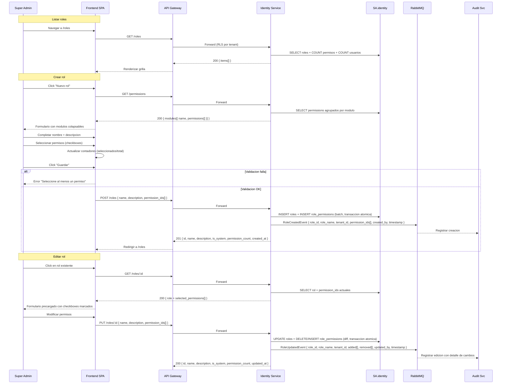

# FL-SEC-02 — Gestionar Roles y Permisos Atomicos

> **Dominio:** Identity
> **Version:** 1.2.0
> **HUs:** HU026

---

## 1. Objetivo

Permitir al Super Admin crear, editar y eliminar roles con permisos atomicos granulares organizados por modulo, para definir los niveles de acceso del sistema.

## 2. Alcance

**Dentro:**
- Listar roles con contadores (permisos, usuarios).
- Crear y editar roles con seleccion de permisos por modulo.
- Checkbox maestro por modulo + contadores.
- Eliminar rol (si no tiene usuarios asignados).
- 7 roles predefinidos como seed data.
- 15 modulos, 88 permisos atomicos.
- Roles de sistema (`is_system = true`): permisos editables, nombre inmutable.

**Fuera:**
- Permisos custom por tenant (todos los tenants comparten el catalogo de 88 permisos, RN-SEC-17).
- Herencia de roles (un rol no hereda de otro; permisos son atomicos, no jerarquicos).
- Permisos por recurso individual (solo por modulo+accion).

**Reglas de negocio aplicables:** RN-SEC-13 (roles predefinidos protegidos), RN-SEC-14 (unicidad nombre por tenant), RN-SEC-15 (eliminacion fisica solo sin usuarios), RN-SEC-16 (diff de permisos en edicion), RN-SEC-17 (catalogo global de permisos), RN-SEC-18 (propagacion de cambios al refresh token).

## 3. Actores y Ownership

| Actor | Rol en el flujo |
|-------|----------------|
| Super Admin | CRUD completo de roles |
| Identity Service | Persiste roles y relaciones con permisos |
| Audit Service | Registra creacion, edicion y eliminacion de roles |
| Audit Service (consumer) | Registra eventos de creacion, edicion y eliminacion de roles via RabbitMQ (async) |

## 4. Precondiciones

- Identity Service operativo (SA.identity accesible y saludable).
- Tabla `permissions` inicializada con 88 registros (15 modulos) — catalogo global sin tenant_id (RN-SEC-17).
- 7 roles predefinidos creados via seed con `is_system = true` (RN-SEC-13).
- Super Admin autenticado con JWT valido conteniendo los permisos correspondientes a la operacion: `p_roles_list` (listar), `p_roles_create` (crear), `p_roles_edit` (editar), `p_roles_delete` (eliminar).
- RLS activo: `tenant_id` resuelto desde JWT claim. Validado antes de `SET LOCAL app.current_tenant` (401 TENANT_CLAIM_MISSING si invalido).
- RabbitMQ operativo (para eventos async: RoleCreatedEvent, RoleUpdatedEvent, RoleDeletedEvent).

## 5. Postcondiciones

- Rol creado/editado: registro en `roles` + relaciones en `role_permissions`, evento de auditoria (async via RabbitMQ).
- Rol eliminado: registros fisicos eliminados de `roles` + `role_permissions` (eliminacion fisica, no soft-delete), evento de auditoria.
- Usuarios con el rol editado: permisos actualizados al proximo refresh token (RN-SEC-18, D-SEC-03). El JWT activo mantiene los claims originales hasta su expiracion (15 min). No se fuerza logout ni se invalidan JWT activos. Los roles y permisos se recargan de la base de datos en cada refresh (RF-SEC-03, paso 8).

## 6. Secuencia Principal

### 6a. Alternativas de Creacion

| Condicion | Resultado |
|-----------|-----------|
| JWT ausente o invalido | 401 AUTH_UNAUTHORIZED |
| Sin permiso `p_roles_create` en JWT | 403 AUTH_FORBIDDEN |
| Nombre duplicado en el tenant | 409 ROLE_NAME_DUPLICATE (RN-SEC-14) |
| UUID de permiso inexistente | 422 ROLE_PERMISSION_NOT_FOUND |
| Permisos vacios (`permission_ids = []`) | 422 ROLE_PERMISSIONS_EMPTY |
| `name` fuera de rango (3-100 chars), `description` vacia o fuera de rango (3-500 chars), `permission_ids` con duplicados | 422 VALIDATION_ERROR |
| tenant_id ausente o invalido en JWT | 401 TENANT_CLAIM_MISSING |
| Tenant tiene >= 500 roles (configurable) | 422 ROLE_LIMIT_EXCEEDED |

### 6b. Alternativas de Edicion

| Condicion | Resultado |
|-----------|-----------|
| JWT ausente o invalido | 401 AUTH_UNAUTHORIZED |
| Sin permiso `p_roles_edit` en JWT | 403 AUTH_FORBIDDEN |
| Rol no encontrado | 404 ROLE_NOT_FOUND |
| Intento de renombrar rol de sistema (`is_system = true`) | 403 ROLE_SYSTEM_RENAME (RN-SEC-13) |
| Nombre duplicado en el tenant (excluyendo el propio rol) | 409 ROLE_NAME_DUPLICATE (RN-SEC-14) |
| UUID de permiso inexistente | 422 ROLE_PERMISSION_NOT_FOUND |
| Permisos vacios (`permission_ids = []`) | 422 ROLE_PERMISSIONS_EMPTY |
| `name` fuera de rango, `description` vacia, formato invalido | 422 VALIDATION_ERROR |
| tenant_id ausente o invalido en JWT | 401 TENANT_CLAIM_MISSING |
| Edicion del rol Super Admin remueve permisos criticos (`p_roles_*`, `p_users_*`) | 422 ROLE_ADMIN_LOCKOUT_RISK |
| JWT tiene `p_roles_list` pero NO `p_roles_edit` al llamar GET /roles/:id | 403 FORBIDDEN |

### 6c. Endpoint GET /permissions

| Paso | Detalle |
|------|---------|
| 1 | SPA solicita GET /permissions al abrir formulario de crear/editar rol |
| 2 | Requiere permiso p_roles_create O p_roles_edit |
| 3 | Retorna catalogo agrupado por modulo: { modules[{ name, permissions[{ id, code, action, module }] }] } |
| 4 | Catalogo global (no filtrado por tenant — permissions es tabla seed) |

### 6d. Endpoint GET /roles/:id (detalle de rol para precarga de edicion)

| Paso | Detalle |
|------|---------|
| 1 | SPA solicita GET /roles/:id al navegar a edicion de un rol |
| 2 | Requiere permiso `p_roles_edit` (NO `p_roles_list`) — decision cerrada en RF-SEC-11 |
| 3 | Retorna: `{ id, name, description, is_system, permissions[{ id, module, action, code }] }` |
| 4 | Si no encontrado: 404 ROLE_NOT_FOUND |
| 5 | Si usuario solo tiene `p_roles_list`: `403 { code: "FORBIDDEN", detail: "p_roles_edit required for GET /roles/:id" }` |
| 6 | JWT ausente o invalido: 401 AUTH_UNAUTHORIZED |
| 7 | tenant_id ausente o invalido en JWT: 401 TENANT_CLAIM_MISSING |

> **Nota:** No existe un endpoint separado de solo lectura para ver el detalle de un rol. La vista de detalle de permisos de un usuario se resuelve en RF-SEC-08 (GET /users/:id), que calcula los permisos efectivos como union de todos los roles del usuario. El endpoint GET /roles/:id es exclusivo para precarga del formulario de edicion.

## 7. Secuencias Alternativas

### 7a. Eliminar Rol

> **Validacion previa:** Si `id` no es UUID valido: 422 VALIDATION_ERROR.

| Paso | Accion | Servicio |
|------|--------|----------|
| 1 | Super Admin presiona "Eliminar" en la grilla | SPA |
| 2 | Confirmacion: "Este rol sera eliminado permanentemente. ¿Desea continuar?" | SPA |
| 3 | DELETE /roles/:id | API Gateway → Identity |
| 3a | Validar JWT y verificar permiso `p_roles_delete` | Identity |
| 4 | Verificar existencia del rol (404 ROLE_NOT_FOUND si no existe) | Identity |
| 5 | Verificar `is_system = false` | Identity |
| 5a | Si `is_system = true`: 403 ROLE_SYSTEM_PROTECTED (RN-SEC-13) | Identity |
| 6 | Verificar que no hay usuarios con este rol: `COUNT(*) FROM user_roles` con JOIN a `roles` para filtrar por `tenant_id` | Identity |
| 6a | Si tiene usuarios: 409 ROLE_IN_USE "Rol en uso por {N} usuario(s). Reasigne los usuarios antes de eliminar." (RN-SEC-15) | Identity |
| 6b | Si no tiene usuarios: en transaccion DELETE role_permissions + DELETE roles (eliminacion fisica) | Identity |
| 7 | RoleDeletedEvent `{ role_id, role_name, tenant_id, deleted_by, timestamp }` | Identity → RabbitMQ → Audit |
| 8 | Retornar 204 No Content | Identity |

**Errores tipados de eliminacion:**

| Condicion | Resultado |
|-----------|-----------|
| JWT ausente o invalido | 401 AUTH_UNAUTHORIZED |
| Sin permiso `p_roles_delete` en JWT | 403 AUTH_FORBIDDEN |
| Rol no encontrado | 404 ROLE_NOT_FOUND |
| Rol de sistema (`is_system = true`) | 403 ROLE_SYSTEM_PROTECTED |
| Rol asignado a usuarios | 409 ROLE_IN_USE |
| `id` no es UUID valido | 422 VALIDATION_ERROR |
| tenant_id ausente o invalido en JWT | 401 TENANT_CLAIM_MISSING |

### 7b. Checkbox Maestro por Modulo (comportamiento UI)

| Accion | Resultado |
|--------|-----------|
| Marcar checkbox maestro | Todos los permisos del modulo se seleccionan |
| Desmarcar checkbox maestro | Todos los permisos del modulo se deseleccionan |
| Marcar todos los individuales | Checkbox maestro se marca automaticamente |
| Desmarcar uno individual | Checkbox maestro se desmarca (estado indeterminado) |
| Contador se actualiza | `(seleccionados/total)` por modulo y global |

> **Nota RF:** El comportamiento del checkbox maestro (mark all, unmark all, indeterminado en seleccion parcial) es logica puramente frontend. Los contadores (seleccionados/total por modulo y global, formato `{N}/{total}`) se actualizan en tiempo real en el SPA. El backend no valida ni retorna estos valores.

## 8. Slice de Arquitectura

- **Servicio owner:** Identity Service (.NET 10, SA.identity)
- **Comunicacion sync:** SPA → API Gateway → Identity Service
- **Comunicacion async:** Identity → RabbitMQ → Audit Service
- **RLS:** `roles` y `role_permissions` filtrados por `tenant_id`
- **Tabla global:** `permissions` (sin tenant_id, catalogo compartido)

> **Validacion tenant_id:** Antes de ejecutar `SET LOCAL app.current_tenant`, se valida que el claim `tenant_id` del JWT no sea null, vacio, ni UUID malformado. Si es invalido: 401 TENANT_CLAIM_MISSING. Esto previene que RLS se ejecute con un tenant vacio (potencial leak multi-tenant).

## 9. Data Touchpoints

| Entidad | Operacion | Evento |
|---------|-----------|--------|
| `roles` | INSERT | `RoleCreatedEvent { role_id, role_name, tenant_id, permission_ids[], created_by, timestamp }` |
| `roles` | UPDATE | `RoleUpdatedEvent { role_id, role_name, tenant_id, added[], removed[], updated_by, timestamp }` |
| `roles` | DELETE | `RoleDeletedEvent { role_id, role_name, tenant_id, deleted_by, timestamp }` |
| `role_permissions` | INSERT, DELETE (batch) | — (incluido en eventos de rol) |
| `permissions` | SELECT (solo lectura) | — (catalogo global, seed data, RN-SEC-17) |
| `user_roles` | SELECT (verificacion en delete) | — |
| `audit_log` (SA.audit) | INSERT (async) | Consume eventos via RabbitMQ |

**Estados relevantes:**
- Roles no tienen ciclo de estado (existen o no existen).
- Cambios en permisos de rol afectan a usuarios al proximo refresh token (RN-SEC-18, D-SEC-03). El JWT activo mantiene los claims originales hasta su expiracion (15 min). No se fuerza logout ni se invalidan JWT activos.

> **Campos de auditoria:** `roles.created_by` y `roles.updated_by` se pueblan con el `user_id` extraido del claim `sub` del JWT. No se envian desde el cliente.

## 10. RF Candidatos para `04_RF.md`

| RF candidato | Descripcion | Origen FL |
|-------------|-------------|-----------|
| RF-SEC-09 | Listar roles con contadores de permisos y usuarios | Seccion 6 (listar) |
| RF-SEC-10 | Crear rol con seleccion de permisos atomicos por modulo | Seccion 6 (crear) |
| RF-SEC-11 | Editar nombre, descripcion y permisos de un rol con diff | Seccion 6 (editar) + 6d (GET /roles/:id precarga) |
| RF-SEC-12 | Eliminar rol con validacion de asignacion y proteccion de sistema | Seccion 7a |

> **Nota:** RF-SEC-08 (Ver detalle de usuario con permisos efectivos) referencia los permisos de roles como union para calcular `effective_permissions`. El endpoint GET /roles/:id no tiene RF propio; se documenta como parte de RF-SEC-11 (precarga para edicion).

## 11. Riesgos y Mitigaciones

| Riesgo | Impacto | Mitigacion |
|--------|---------|------------|
| Eliminar permisos de rol activo sin que usuarios lo noten | Medio | Cambios surten efecto al refresh (15-30min max); UI muestra aviso |
| Seed data de permisos desincronizado con codigo | Medio | Migracion EF Core valida que los 88 permisos existen al arrancar |
| Eliminacion accidental de rol predefinido | Bajo | Roles predefinidos marcados como `is_system = true` (no eliminables) |
| Lockout de Super Admin por edicion de permisos del rol Super Admin | Alto | Agregar constraint: permisos del rol Super Admin (seed) deben incluir siempre todos los p_roles_* y p_users_*. Validar en RF-SEC-11 antes de guardar |
| tenant_id null/malformado en JWT → RLS sin filtro | Alto | Validar claim antes de SET LOCAL; rechazar con 401 si invalido |
| user_roles COUNT sin tenant scope | Medio | Agregar JOIN a roles con filtro tenant_id en la consulta de RF-SEC-12 |
| Flood de creacion de roles | Bajo | Limite maximo de roles por tenant: configurable, sugerido 500 (RF-SEC-10) |

## 12. RF Handoff Checklist

- [x] Actor ownership explicito en cada paso.
- [x] Diagramas explican el flujo sin prosa larga.
- [x] Riesgos y mitigaciones documentados.
- [x] Traducible a RF atomicos y testeables.
- [x] Dentro del limite de 1 pagina.
- [x] Sin dependencias criticas desconocidas.

---

## Changelog

### 1.2.0
- Cross-referencia con RF-SEC.md v1.2.0: alineacion completa de errores tipados, payloads de eventos, y reglas de negocio.
- Precondiciones: agregadas Identity Service operativo, RLS activo con validacion, referencias a RN-SEC-13 y RN-SEC-17.
- Seccion 5 (Postcondiciones): detallada propagacion de permisos (RN-SEC-18, D-SEC-03, RF-SEC-03) incluyendo ventana de 15 min del JWT.
- Seccion 6a: agregados errores AUTH_UNAUTHORIZED, AUTH_FORBIDDEN, VALIDATION_ERROR, ROLE_LIMIT_EXCEEDED.
- Seccion 6b: agregados errores AUTH_UNAUTHORIZED, AUTH_FORBIDDEN, ROLE_PERMISSIONS_EMPTY, VALIDATION_ERROR, ROLE_ADMIN_LOCKOUT_RISK, FORBIDDEN (GET con p_roles_list sin p_roles_edit).
- Seccion 6d: expandida con errores AUTH_UNAUTHORIZED y TENANT_CLAIM_MISSING; agregada nota sobre inexistencia de endpoint read-only separado.
- Seccion 7a: alineada con RF-SEC-12 — errores tipados (ROLE_SYSTEM_PROTECTED, ROLE_IN_USE, AUTH_UNAUTHORIZED, AUTH_FORBIDDEN), respuesta 204 No Content, orden de validacion, tabla de errores dedicada.
- Seccion 9 (Data Touchpoints): payloads completos de RoleCreatedEvent, RoleUpdatedEvent y RoleDeletedEvent; detalle de propagacion con ventana JWT.
- Seccion 10 (RF Candidatos): titulos alineados con RF-SEC; agregada nota sobre RF-SEC-08 y GET /roles/:id.
- Secuencia principal: payloads de eventos y cuerpos de respuesta alineados con RF (201 con body, 200 con body).
- Alcance: agregadas referencias explicitas a RN-SEC-13 a RN-SEC-18.

### 1.1.0
- Alcance: agregada nota sobre roles de sistema (is_system = true): permisos editables, nombre inmutable.
- Actores: agregado Audit Service (consumer) con detalle de comunicacion async via RabbitMQ.
- Precondiciones: expandidos los cuatro permisos atomicos (p_roles_list, p_roles_create, p_roles_edit, p_roles_delete); agregada precondicion de RabbitMQ operativo.
- Seccion 6: agregadas subsecciones 6a (alternativas de creacion), 6b (alternativas de edicion), 6c (endpoint GET /permissions), 6d (endpoint GET /roles/:id detalle).
- Seccion 7a: agregada validacion previa de UUID en eliminar rol.
- Seccion 7b: agregada nota RF sobre logica frontend del checkbox maestro y contadores.
- Seccion 8: agregada nota de validacion de tenant_id antes de SET LOCAL (prevencion leak multi-tenant).
- Seccion 9: agregada nota sobre campos de auditoria created_by/updated_by desde JWT.
- Seccion 11: agregados 4 riesgos (lockout Super Admin, tenant_id malformado, user_roles sin tenant scope, flood de roles).
