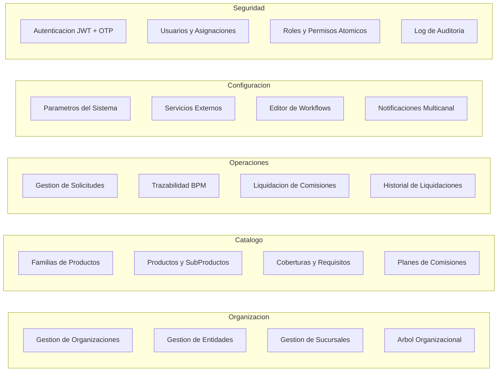

# 01 — Alcance Funcional

> **Proyecto:** Unazul Backoffice
> **Version:** 1.0.0
> **Fecha:** 2026-03-15

---

## 1. Objetivo del producto

Proveer una plataforma de backoffice multi-organizacion y multi-entidad para que organizaciones financieras argentinas (bancos, aseguradoras, fintechs, cooperativas, mutuales y SGRs) gestionen de forma centralizada sus entidades, productos financieros, solicitudes operativas, comisiones y workflows de proceso, con parametrizacion completa y auditoria inmutable.

**Criterio de exito:** una organizacion puede operar sus entidades, procesar solicitudes y liquidar comisiones sin intervencion manual fuera de la plataforma.

---

## 2. Propuesta de valor

1. **Multi-tenancy jerarquico** — Organizacion > Entidad > Sucursal, con aislamiento de datos y permisos por nivel.
2. **Catalogo financiero flexible** — 5 categorias de producto (prestamos, seguros, cuentas, tarjetas, inversiones) con atributos tecnicos diferenciados por categoria y planes de comision configurables.
3. **Motor de workflows visual** — Editor drag-and-drop con nodos de decision, llamadas a servicio, temporizadores y envio de mensajes; sin necesidad de codigo.
4. **Parametrizacion total** — Datos maestros (provincias, ciudades, monedas, redes de tarjeta, coberturas) y configuracion tecnica (mascaras, integraciones, seguridad) administrables desde UI.
5. **Trazabilidad y auditoria** — Timeline BPM por solicitud y log inmutable de toda accion del sistema, exportable.

---

## 3. Mapa de capacidades

---

## 4. Actores

| Actor | Tipo | Responsabilidad principal |
|-------|------|--------------------------|
| Super Admin | Humano | Acceso total; gestiona organizaciones, configuracion global y seguridad |
| Admin Entidad | Humano | Administra entidades, sucursales, usuarios y solicitudes de su entidad |
| Operador | Humano | Procesa solicitudes, gestiona documentos y observaciones |
| Admin Producto | Humano | Mantiene catalogo de familias, productos, planes y comisiones |
| Disenador de Procesos | Humano | Disena workflows en el editor visual |
| Auditor | Humano | Consulta logs de auditoria y exporta reportes (solo lectura) |
| Consulta | Humano | Lectura en todos los modulos |
| API Gateway | Sistema | Enruta peticiones a microservicios, aplica autenticacion |
| Notification Service | Sistema | Envia Email, SMS y WhatsApp segun plantillas configuradas |
| RabbitMQ | Sistema | Bus de eventos entre microservicios |

---

## 5. Areas funcionales de alto nivel

### 5.1 Organizacion
- CRUD de organizaciones (tenants), entidades y sucursales.
- Vista de arbol jerarquico organizacional.

### 5.2 Catalogo de Productos
- Familias de productos con prefijos que determinan categoria (PREST, SEG, CTA, TARJETA, INV).
- Productos con sub-productos/planes, coberturas, requisitos y atributos tecnicos por categoria.
- Planes de comisiones (fijo por venta, porcentaje capital, porcentaje total prestamo).

### 5.3 Operaciones
- Solicitudes con ciclo de vida (draft > pending > in_review > approved/rejected > settled/cancelled).
- Detalle en 7 solapas: solicitante, producto, domicilio, beneficiarios, documentos, observaciones, trazabilidad.
- Liquidacion masiva de comisiones con preliquidacion, confirmacion y exportacion Excel.
- Historial de liquidaciones con descarga de reportes.
- Envio de mensajes (Email/SMS/WhatsApp) desde la solicitud.

### 5.4 Configuracion
- Parametros del sistema agrupados en 18+ grupos (general, seguridad, notificaciones, datos maestros, tecnicos).
- Servicios externos (REST, GraphQL, SOAP, MCP, Webhook) con multiples esquemas de autenticacion.
- Editor visual de workflows con 7 tipos de nodo y panel de atributos.
- Plantillas de notificacion con variables dinamicas.

### 5.5 Seguridad
- Autenticacion con JWT + recuperacion por OTP.
- Usuarios con asignaciones jerarquicas (organizacion, entidad, sucursal).
- 88 permisos atomicos en 15 modulos, 7 roles predefinidos.
- Log de auditoria inmutable con exportacion.

### 5.6 Dashboard
- Metricas resumen (entidades, usuarios, productos, solicitudes).
- Graficos por organizacion y por entidad.
- Actividad reciente del sistema.

---

## 6. Fuera de alcance / Evolucion futura

- **Admin Portal** separado (referenciado en arquitectura pero fuera del MVP).
- Integracion directa con core bancario o sistemas legacy.
- App mobile nativa.
- Gestion de cobranzas y pagos.
- Reporteria avanzada / BI embebido.
- Onboarding digital del solicitante (formulario publico).
- Multi-idioma (actualmente solo espanol).
