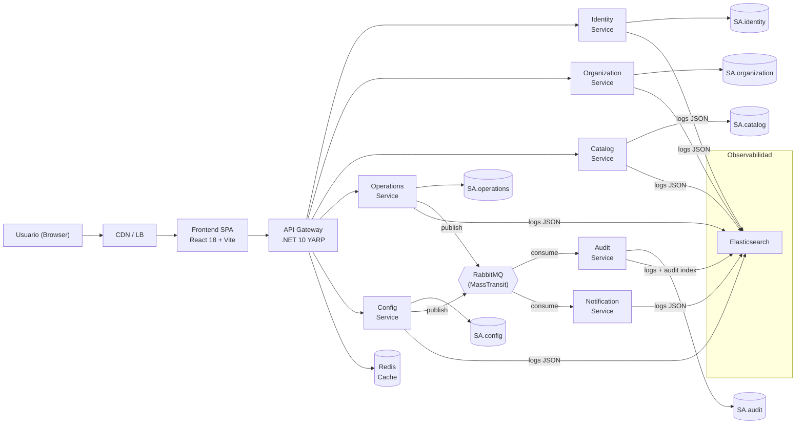
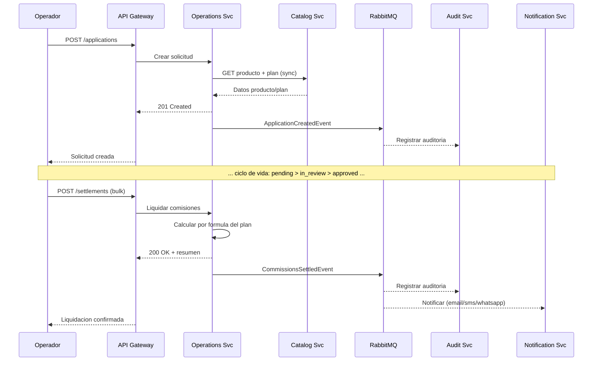

# 02 — Arquitectura

> **Proyecto:** Unazul Backoffice
> **Version:** 1.0.0
> **Fecha:** 2026-03-15
> **Prerequisito:** `01_alcance_funcional.md` aprobado

---

## 0. Project Decision Priority (Fuente de verdad)

1. **Estabilidad** — Aislamiento de fallos, consistencia de datos, disponibilidad.
2. **Mantenibilidad** — Ownership claro, bajo acoplamiento, testabilidad.
3. **Performance** — Tiempos de respuesta aceptables bajo carga normal.
4. **Costo** — Optimizar recursos sin comprometer los tres anteriores.

---

## 1. Resumen Ejecutivo

Unazul Backoffice es una plataforma multi-tenant para organizaciones financieras argentinas. La arquitectura se organiza en 7 microservicios .NET 10 detras de un API Gateway (YARP), con un frontend SPA React 18. La comunicacion es hibrida: HTTP sincrono para CRUD y consultas; RabbitMQ (MassTransit) asincrono para auditoria, notificaciones y eventos de dominio. PostgreSQL como persistencia por servicio con Row-Level Security (RLS) para aislamiento de tenant, Redis como cache distribuido, y Elasticsearch como destino centralizado de logs y motor de busqueda sobre auditoria.

Las decisiones arquitectonicas priorizan estabilidad (database-per-service, RLS, DLQ, circuit breakers) sobre optimizacion prematura de performance o costo.

---

## 2. Vista de Arquitectura General

**Canales:**
- **Sincrono (HTTP):** SPA -> Gateway -> Microservicio para todo CRUD y consultas.
- **Asincrono (RabbitMQ):** Eventos de dominio publicados por Operations/Config, consumidos por Audit y Notification.
- **Logs (Elasticsearch):** Todos los microservicios emiten logs estructurados JSON (ECS) via Serilog.Sinks.Elasticsearch. Audit Service ademas indexa el log de auditoria para busqueda full-text.

---

## 3. Secuencia Critica — Crear Solicitud y Liquidar Comision

**Camino de error:** Si Catalog no responde, Operations retorna 503 con retry del cliente. Si RabbitMQ no esta disponible, MassTransit aplica retry con backoff exponencial; tras agotar reintentos, el mensaje va a DLQ para reproceso manual.

---

## 4. Responsabilidad de Microservicios

| Microservicio | Responsabilidad | Datos que gobierna | Dependencias |
|---|---|---|---|
| **Identity** | Autenticacion, usuarios, roles, permisos | `users`, `roles`, `permissions` | Redis (sesiones), SMTP (OTP) |
| **Organization** | Tenants, entidades, sucursales, arbol org. | `tenants`, `entities`, `branches` | Identity (validar tenant del token) |
| **Catalog** | Familias, productos, planes, coberturas, requisitos, comisiones | `product_families`, `products`, `plans`, `commission_plans` | Organization (validar entidad) |
| **Operations** | Solicitudes, liquidaciones, documentos, trazabilidad | `applications`, `settlements`, `documents`, `trace_events` | Catalog (datos producto), RabbitMQ |
| **Config** | Parametros, servicios externos, workflows, plantillas | `parameters`, `services`, `workflows`, `templates` | RabbitMQ |
| **Audit** | Log inmutable de acciones del sistema | `audit_log` | Ninguna (solo consume eventos) |
| **Notification** | Envio Email/SMS/WhatsApp con plantillas | `notification_log` | Config (plantillas), proveedores externos |

---

## 5. Tecnologias y Decisiones Tecnicas

| Componente | Tecnologia | Motivo | Riesgo | Mitigacion |
|---|---|---|---|---|
| API Gateway | .NET 10 YARP | Consistencia de stack; routing, rate limiting, auth | Punto unico de fallo | Health checks + LB redundante |
| Backend | .NET 10 Minimal APIs | Rendimiento nativo AOT-ready, ecosistema maduro | Curva de aprendizaje Minimal API | Convencion CQRS con Mediator.SourceGenerator |
| Persistencia | PostgreSQL 16 (DB per service) + RLS | Aislamiento de fallos, esquema independiente; RLS garantiza aislamiento de tenant a nivel de fila | Complejidad operativa multi-DB, politicas RLS por tabla | Docker Compose dev; managed DB en prod; RLS policies generadas por migracion |
| Busqueda y Logs | Elasticsearch 8.x | Logs centralizados en formato ECS, busqueda full-text sobre auditoria, dashboards operativos | Consumo de recursos, drift de mapping | Index lifecycle management (ILM), templates estrictos, retention 90d |
| Cache | Redis 7.x | Baja latencia para parametros, sesiones, lookups frecuentes | Perdida de cache | Fallback a DB; TTL conservadores |
| Mensajeria | RabbitMQ 3.13 + MassTransit | Desacople auditoria/notificaciones; retry/DLQ nativo | Cola saturada | Prefetch limitado, alertas en queue depth |
| ORM | EF Core 10 | Productividad, migraciones; compatible AOT | Queries N+1 | Projection explicita, revisiones de query |
| Frontend | React 18 + Vite + shadcn/ui | Componentizacion, DX rapido, Tailwind | Bundle size | Lazy loading por ruta |
| Observabilidad | OpenTelemetry + Serilog + Elasticsearch | Traces distribuidos, correlacion end-to-end, logs centralizados en formato ECS | Volumen de logs | Sampling en produccion, ILM con retention 90d, indices diarios |
| Testing | xUnit + NSubstitute + TestContainers | Tests de integracion realistas con PostgreSQL | Tiempo de CI | Paralelizacion, cache de imagenes |

---

## 6. Seguridad, Observabilidad y Resiliencia

**Autenticacion/Autorizacion:**
- JWT Bearer en API Gateway; refresh token con rotacion.
- Policy-based authorization por microservicio (88 permisos atomicos).
- Tenant isolation en dos capas:
  1. **Aplicacion:** claim `tenantId` en JWT; cada query filtra por tenant.
  2. **Base de datos:** PostgreSQL Row-Level Security (RLS) como segunda barrera. Cada tabla multi-tenant tiene policy `USING (tenant_id = current_setting('app.current_tenant')::uuid)`. El connection middleware setea `SET app.current_tenant` al inicio de cada request. Esto previene data leaks incluso ante bugs en queries de aplicacion.

**Observabilidad:**
- Correlation ID propagado en headers HTTP y message headers de RabbitMQ.
- Serilog structured logging en formato **ECS (Elastic Common Schema)** via `Serilog.Sinks.Elasticsearch`. Campos obligatorios por log entry: `@timestamp`, `log.level`, `message`, `trace.id`, `service.name`, `user.id`, `labels.tenantId`.
- Indices Elasticsearch diarios por servicio (`logs-{service}-{yyyy.MM.dd}`) con ILM policy: hot 7d, warm 30d, delete 90d.
- Audit Service indexa ademas en `audit-{yyyy.MM.dd}` para busqueda full-text sobre acciones del sistema (modulo, usuario, operacion).
- Health checks por servicio expuestos en `/health` (liveness + readiness).

**Resiliencia:**
- Retry exponencial con jitter en MassTransit (3 intentos, backoff 5s/15s/45s).
- Dead Letter Queue para mensajes fallidos con alerta.
- Circuit breaker en llamadas HTTP entre servicios (Polly).
- Cada servicio tolera caida de dependencias no criticas (auditoria async no bloquea operacion).

---

## 7. Insumos para FL

| Flow candidato | Actor principal | Servicios involucrados | Estado/Evento critico | Riesgo tecnico |
|---|---|---|---|---|
| FL-ORG-01 Gestionar organizacion | Super Admin | Organization, Audit | TenantCreated, TenantUpdated | Ninguno significativo |
| FL-ORG-02 Gestionar entidad + sucursales | Admin Entidad | Organization, Audit | EntityCreated, BranchCreated | Validacion de canales habilitados |
| FL-CAT-01 Gestionar catalogo de productos | Admin Producto | Catalog, Organization, Audit | ProductCreated, PlanCreated | Consistencia familia-categoria-atributos |
| FL-OPS-01 Ciclo de vida de solicitud | Operador | Operations, Catalog, Notification, Audit | draft>pending>in_review>approved/rejected>settled | Transicion de estados, concurrencia en liquidacion |
| FL-OPS-02 Liquidar comisiones | Operador | Operations, Catalog, Notification, Audit | CommissionsSettledEvent | Calculo bulk, consistencia de montos, lock optimista |
| FL-OPS-03 Enviar mensaje desde solicitud | Operador | Operations, Config, Notification | MessageSentEvent | Disponibilidad proveedor externo |
| FL-CFG-01 Gestionar parametros y servicios | Super Admin | Config, Audit | ParameterUpdated, ServiceTested | Cache invalidation cross-service |
| FL-CFG-02 Disenar workflow | Disenador de Procesos | Config, Audit | WorkflowPublished | Validacion de grafo (sin ciclos, inicio/fin unicos) |
| FL-SEC-01 Autenticacion y gestion de usuarios | Super Admin / Admin Entidad | Identity, Audit | Login, OTPVerified, UserCreated | Bloqueo por intentos, OTP expiracion |
| FL-SEC-02 Gestionar roles y permisos | Super Admin | Identity, Audit | RoleUpdated | Propagacion de cambios de permisos a sesiones activas |
| FL-DSH-01 Dashboard y metricas | Todos los roles | Operations, Organization, Catalog, Audit | N/A (lectura) | Performance en queries agregadas |

**Checklist de cierre:**
- [x] Cada flow tiene actor y dueno tecnico claros.
- [x] Cada flow tiene estados/eventos minimos definidos.
- [x] No quedan decisiones criticas abiertas.
- [x] El contenido alcanza para iniciar `crear-flujo` sin supuestos implicitos.

---

## 8. Supuestos y Limites

1. Cada microservicio tiene su propia base de datos PostgreSQL (no se comparten esquemas).
2. El frontend es una SPA unica que consume todos los servicios via API Gateway.
3. Multi-tenancy se resuelve por filtro de datos (shared DB) con PostgreSQL RLS como barrera obligatoria a nivel de base de datos; no se usa base de datos separada por tenant.
4. Los proveedores de notificacion (Twilio, Meta, SMTP) son configurados por parametros, no hardcodeados.
5. El MVP no incluye alta disponibilidad multi-region; single-region con redundancia interna.

**Fuera de alcance arquitectonico:** Admin Portal separado, integracion con core bancario, app mobile nativa (ver `01_alcance_funcional.md` seccion 6).
